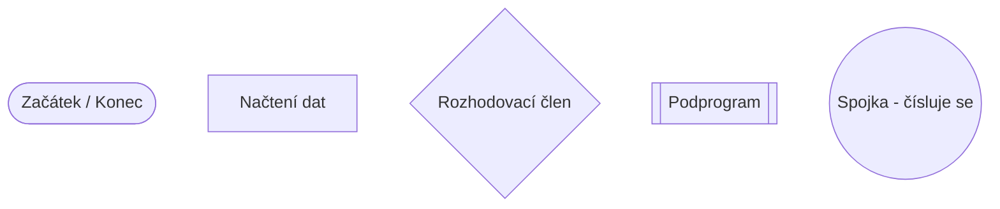
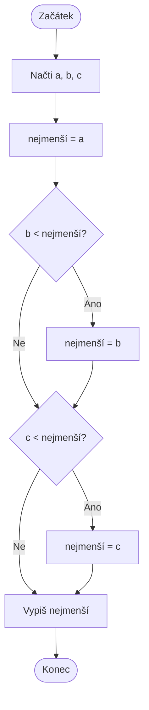
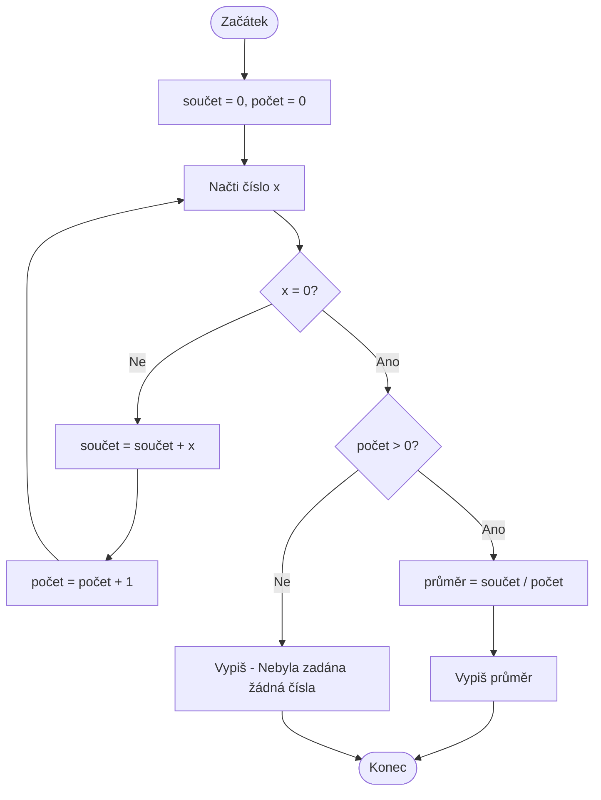
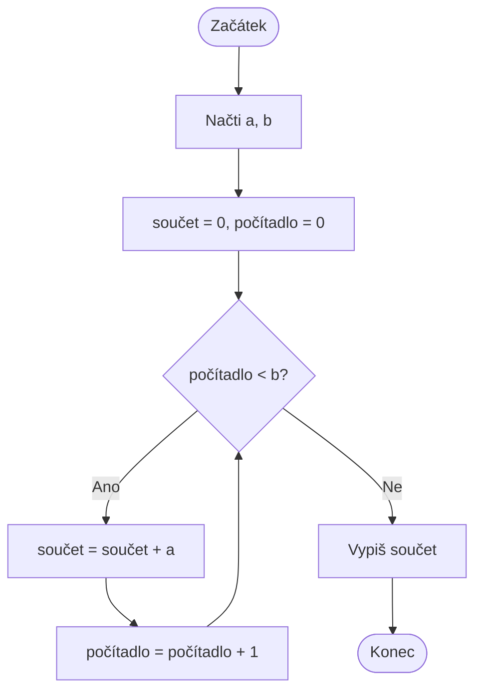

### Úvodní přendáška:

- Úvod do předmětu a požadavky
- Základy algoritmizace
- Formální zápis algoritmu
- Příklady k procvičení

___

### Úvod do předmětu:
- Předpoklady, dovednosti
	- Základní matematické schopnosti
	- Hledání řešení problémů
	- Optimalizace řešení problemů
- Cvičení a přednášky
	- náplní cvičení je praktické řešení algoritmických úloh, ověření správnosti řešení a implementace v grafickém prostředí Snap! 
	- s ohledem na omezené množství cvičení budou praktické úlohy (vhodné k zápočtu i zkoušce) řešeny i na přednášce 
	- účast na cvičeních a přednáškách je nepovinná, ale předmět není možné se naučit "přes noc"
	- pro programátory je doporučeno naučit se formální zápis algoritmů
- Zápočet:
	- od 2. přednášky se každý týden v termínu přednášky bude psát v Moodle malý testík po jednom bodu, k zápočtu je nutné získat alespoň 6 bodů z deseti
	- 1 opravný termín v lednu ve formě komplexního testu
	- oblasti zápočtového testu
		- matematická logika
		- čtení strukturogramů
		- tvorba strukturogramů (definice podmínek) 
		- rekurze 
		- volání funkcí
		- logické hádanky
- Zkouška:
	- ústní zkouška
		- zkoušení ve skupinách 
		- diskuze nad zadaným algoritmem/programem 
		- na základě zapojení studentů bude navrženo individuální hodnocení
- Návaznosti:
	- předmět Programování v letní semestru
	- implementace úloh z algoritmizace v jazyce C# 
	- dále předmět Komponentová tvorba SW

___

### Základy algoritmizace:
- Vlastnosti algoritmů:
	- Konečnost:
		- algoritmus musí vždy skončit 
		- počet kroků do ukončení není fixní a nemusí být předem znát, ale je vždy konečný
	- Zobecnitelnost:
		- algoritmus neřeší úlohu pro jeden konkrétní vstup, ale celou skupinu úloh 
		- např. algoritmus pro násobení čísel nemůže fungovat pouze pro čísla 3 a 5
		- řešená oblast je dána zadáním algoritmu
	- Determinovanost:
		- v každém kroku je možné se na základě vnitřního stavu algoritmu rozhodnout, jaký (právě jeden) krok bude následovat
	- Elementárnost:
		- algoritmus se skládá z elementárních (nedělitelných) kroků 
		- tyto elementární prvky tvoří jazyk algoritmu:
			- piš "Ahoj" 
			- Udělěj_krok 
			- Otoč_se
	- Resultativnost:
		- každý algoritmus vrací výsledek
		- výsledek může být zobrazení informace na monitoru, uložení výsledku do souboru nebo jakékoliv jiné předání uživateli nebo jinému algoritmu
- Stavebníkameny algoritmů:
	- sekvence 
	- selekce
	- iterace
- Proměnné:
	- proměnné slouží k uložení dat v průběhu provádění algoritmu 
	- zachycují vnitřní stav algoritmu
- Algoritmické úlohy:
	- řadící algoritmy 
	- vyhledávací algoritmy 
	- optimalizační algoritmy
	- úlohy pro podporu lidské činnosti

___

### Formální zápis algoritmů:
- Textový popis:
	- zápis pomocí textových příkazů a dotazů 
	- příklady:
		- udělej krok
		- otoč se o 90 stupňů
		- mám před sebou překážku?
		- dokud je počet kroků<10, dělej...
- Pseudokód:
	- mezistupeň mezi textovým popisem, grafickým zápisem algoritmu a kódem v konkrétním jazyce
	- používá standardizované příkazy a operace 
	- příklady:
		- krok 
		- když (měsíc=12) pak (něco) jinak (něco jiného) 
		- dokud (počet_kroků<10) dělej (něco)
- Vývojové diagramy:

### Algoritmické úlohy k procvičení:
- Vyhledání nejmenšího prvku
	- máte zadaná 3 čísla a, b, c 
	- rozhodněte, jaká je hodnota nejmenšího čísla z těchto čísel

- Průměr v zadané posloupnosti:
	- algoritmus spočítá průměr čísel v zadané posloupnosti 
	- postupně se ptejte na čísla
	- pokud uživatel zadá číslo 0, znamená to ukončení zadávání a algoritmus vypíše průměr ze zadaných čísel

- Vynásobení celých kladných čísel
	- pomocí operace sčítání vynásobte 2 zadaná čísla
	- obě čísla jsou kladná a celá 
	- jako rozšíření můžete algoritmus upravit na všechna celá čísla

