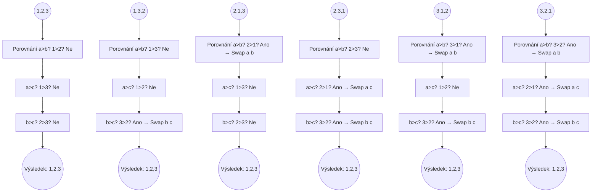
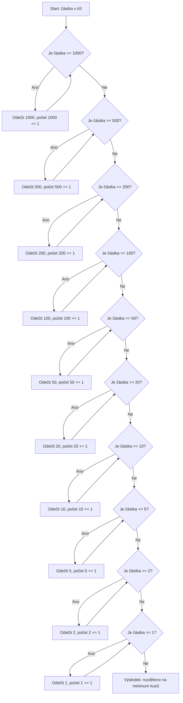
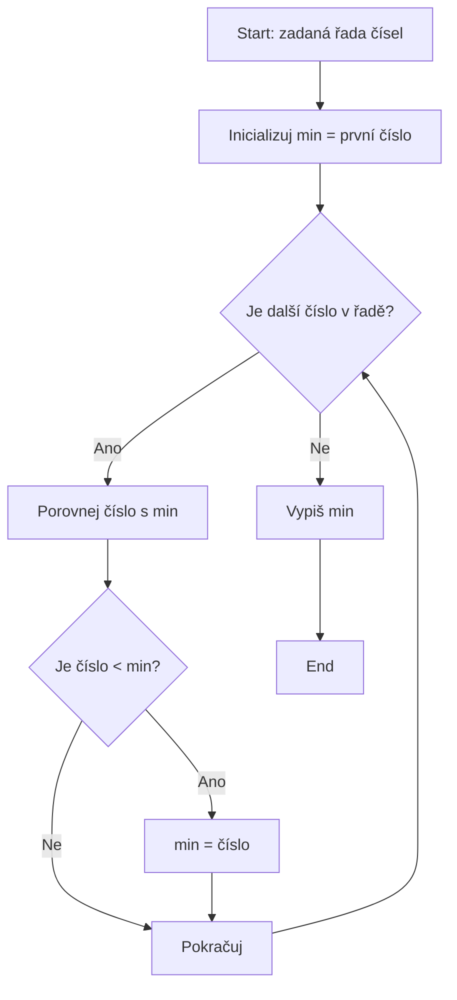
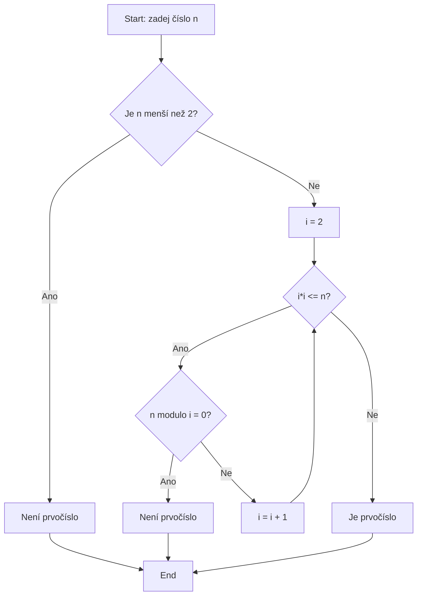

### Co je to algoritmus?
- Postup, návod, jak vyřešit nějakou úlohu / problém

### Vlastnosti algoritmů:
- ___Konečnost___ - konečný počet kroků • 
- ___Určitost___ - je přesně specifikováno, co se bude dít (žádné náhodné jevy) 
- ___Korektnost___ - pro platný vstup vrátí správný (a pokaždé stejný) výstup 
- ___Obecnost___ - umí řešit všechny problémy daného “typu”
### Z čeho se algoritmus skládá:
- ___Sekvence___ - příkazy po sobě 
- ___Selekce___ - větvení, podmínky 
- ___Iterace___ - cyklení, opakován
### Způsoby zápisu algoritmů:
- Slovně 
- Vývojové diagramy 
- Strukturogramy 
- Specializované (programovací) jazyky
### Proměnné:
- Je to zástupné jméno pro nějakou zapamatovanou hodnotu, typicky odkaz někam do paměti

### Práce s proměnnými pomocí operátorů:
- **=**  přiřazení 
- == rovnost 
- <> != nerovnost 
- <, >, <=, >= porovnání 
- AND & ∧ logická konjunkce - „a zároveň “ 
- OR || ∨ logická disjunkce - „nebo“ 
- XOR ^ úplná disjunkce, vylučovací nebo - „buď …, anebo …“
- mod modulo: zbytek po dělení -> 7 mod 3 je 1
### Pravdivostní tabulka – Logické AND:
|                 **a**                  |                 **b**                  |              **a AND b**               |
| :------------------------------------: | :------------------------------------: | :------------------------------------: |
| True | True | True |
| True | False  | False  |
| False  | True | False  |
| False  | False  | False  |
### Pravdivostní tabulka – Logické OR:
|                 **a**                  |                 **b**                  |               **a OR b**               |
| :------------------------------------: | :------------------------------------: | :------------------------------------: |
| True | True | True |
| True | False  | True |
| False  | True | True |
| False  | False  | False  |
### Pravdivostní tabulka – Logické XOR:
|                 **a**                  |                 **b**                  |              **a XOR b**               |
| :------------------------------------: | :------------------------------------: | :------------------------------------: |
| True | True | False  |
| True | False  | True |
| False  | True | True |
| False  | False  | False  |
### Typy proměnných:
- Číselné 
- Textové (slova, znaky) 
- Pravdivostní (true, false) 
- … a další
### Výrazy:
- spojení proměnných pomocí operátorů tvoří výraz - de facto jeden příkaz nebo hodnotu, např:
	- ___x = y___ je příkaz, aby se do x nakopírovala hodnota z y 
	- ___x + 3___ je výraz, jehož hodnota je o tři větší, než x
	- ___x = x + 3___ je příkaz, aby se x zvýšilo o tři 
	- ___x > 7___ je výraz, který má hodnotu true nebo false, podle toho jestli je x větší než sedm

___
### Příklad 1:
- Vytvořte algoritmus pro vyřešení zvolené každodenní činnosti. Algoritmus zapište slovně v bodech. Identifikujte, jestli a kde váš algoritmus obsahuje selekci (větvení / podmínky) a iteraci (opakování / cyklení). Pokud neobsahuje, zvažte zda je možné tyto prvky do vašeho algoritmu vhodně zakomponovat, nebo jestli se tyto prvky “neukáží” při zdrobnění algoritmu
	- ## Algoritmus: Příprava čaje
		### Slovní popis algoritmu (v bodech)
		
		1. Připrav si hrnek.
	    
		2. Zkontroluj, jestli je k dispozici čajový sáček.
	    
		    - Pokud **není**, vezmi nový sáček z krabičky.
        
		3. Naplň konvici vodou.
	    
		4. Zapni konvici a **čekej**, dokud se voda neuvaří.
	    
		5. Nalij horkou vodu do hrnku.
	    
		6. Vlož čajový sáček do hrnku.
	    
		7. **Čekej**, dokud se čaj nevylouhuje (např. 3–5 minut).
	    
		8. Vyjmi čajový sáček.
	    
		9. Přidej cukr nebo med, pokud chceš.
	    
		10. Zamíchej.
	    
		11. **Ochutnej čaj** – pokud je příliš horký, **počkáš chvíli**, jinak můžeš pít.
	    
		12. Konec.
### Příklad 2:
- Vytvořte algoritmus, který seřadí tři čísla podle velikosti od nejmenšího po největší. Ověřte, zda funguje správně (tři čísla lze zadat celkem šesti různými způsoby, ověřte všech šest možností). Analyzujte složitost algoritmu (počet porovnání). V případě, že váš algoritmus vyžaduje více jak tři porovnání, pokuste se ho lépe navrhnout / optimalizovat.

### Příklad 3:
- Navrhněte algoritmus, který zadanou částku v korunách rozdělí tak, aby byl použit co nejnižší počet bankovek a mincí. Zamyslete se, jestli je možné tento algoritmus navrhnout tak, aby neobsahoval žádné cykly.

### Příklad 4:
- Navrhněte algoritmus, který ze zadané řady čísel najde a vypíše to nejmenší číslo. Algoritmus zapište nejprve slovně, pak zakreslete pomocí vývojového diagramu

### Příklad 5:
- Vytvořte a pomocí vývojového diagramu zakreslete algoritmus, který pro zadané číslo zjistí, jestli se jedná o prvočíslo nebo nikoliv. Ve vývojového diagramu využijte zápisu operací pomocí vhodně navržených proměnných.

