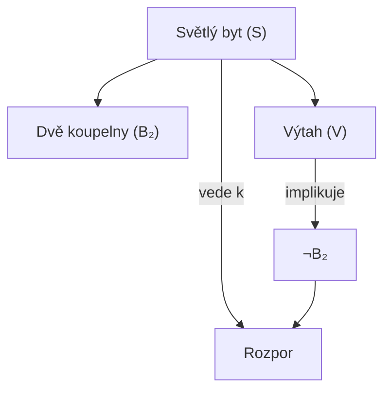
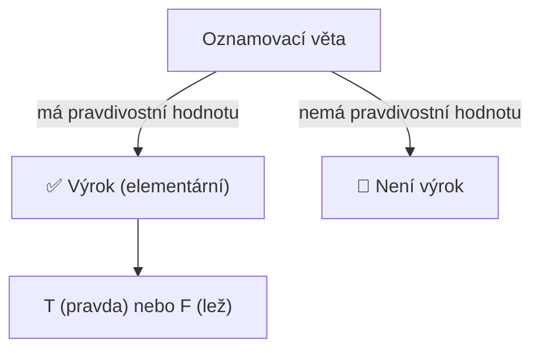
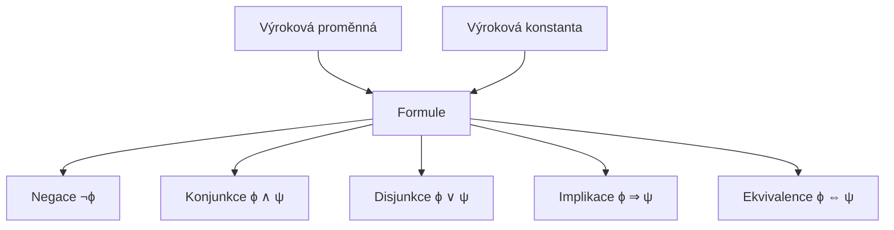

### Jak jsem potkal logiku: U makléře

### Situace
**Zákazník:**  
> Dobrý den, rád bych koupil nějaký světlý byt.  
> Chtěl bych, aby měl dvě koupelny a aby byl v domě výtah.  

**Makléř:**  
> Ano ano, něco máme. Ovšem, pokud budete trvat na výtahu, pak nemůžete mít dvě koupelny.  
> Rozhodně Vám ale nenabídnu něco tmavého, bez výtahu a s jednou koupelnou.  
> A mimochodem, všechny světlé byty v nabídce mají dvě koupelny a výtah.  

---

### Logická analýza

### Označení:
| Symbol | Význam |
|:--:|:--|
| **S** | byt je světlý |
| **B₂** | byt má dvě koupelny |
| **V** | byt má výtah |

---

### Výroky:

1. **Přání zákazníka:**  
   → `S ∧ B₂ ∧ V`

2. **Makléřova tvrzení:**
   - Pokud byt **má výtah**, pak **nemůže mít dvě koupelny**  
     → `V → ¬B₂`
   - Nenabídne byt, který je **tmavý, bez výtahu a s jednou koupelnou**  
     → `¬(¬S ∧ ¬V ∧ ¬B₂)`
   - Každý **světlý byt** má **dvě koupelny a výtah**  
     → `S → (B₂ ∧ V)`

---

### Logický rozpor

Z výroku `S → (B₂ ∧ V)` plyne, že pokud je byt **světlý**, musí mít **dvě koupelny a výtah**.  
Současně však `V → ¬B₂` říká, že pokud má **výtah**, **nemůže mít dvě koupelny**.

 Tedy:  
`S` znamená `V` a `B₂`,  
ale `V` zároveň znamená `¬B₂`.  

To je **logický rozpor (kontradikce)** – výroky nemohou být pravdivé zároveň.

---

### Shrnutí
- Makléřova tvrzení jsou **vzájemně nekonzistentní**.  
- Na první pohled mluví rozumně, ale logicky to **nedává smysl**.  
- Tento příklad ukazuje, jak lze logiku použít k odhalení **skrytých rozporů v běžné komunikaci**.

---

### diagram logické závislosti

### Zakladní pojmy:
#### Základní stavební kameny logiky

### Definice
**Elementární výrok** je **oznamovací věta**, o které má smysl rozhodnout, zda je **pravdivá (pravda)** nebo **nepravdivá (lež)**  
a kterou **chápeme jako nedělitelný celek**.

Jinými slovy:  
> Výrok je základní jednotka logického uvažování, která může nabývat pouze dvou pravdivostních hodnot — **pravda (1)** nebo **lež (0)**.

---

### Příklady (elementární výroky)

| Příklad                      | Význam                                                        | Je výrok? | Poznámka                                     |
| :--------------------------- | :------------------------------------------------------------ | :-------: | :------------------------------------------- |
| „Mám dnes narozeniny.“       | Oznamovací věta – může být pravda nebo lež                    |     ✅     | Dá se ověřit                                 |
| „3 = 9.“                     | Tvrzení, které je **nepravdivé**, ale **má smysl** rozhodnout |     ✅     | Nepravdivý výrok                             |
| „Uvařím švestkové knedlíky.“ | Oznamovací věta o budoucnosti (výrok)                         |     ✅     | Má pravdivostní hodnotu (v budoucnu ověříme) |

---

### Nepříklady (nejsou výroky)

| Nepříklad | Proč to není výrok |
|:--|:--|
| „Jdi pryč!“ | Rozkaz, **nemá pravdivostní hodnotu** |
| „x² − 2 ≥ 3x + 2“ | **Obsahuje proměnnou x**, není možné rozhodnout bez její hodnoty |
| „Jestli budou mít švestky, uvařím švestkové knedlíky.“ | **Podmíněná věta**, sama o sobě **není pravdivá ani nepravdivá**, dokud nevíme, jestli platí podmínka |

---

### Shrnutí

- **Výrok** = oznamovací věta, kterou nelze dál rozložit na jednodušší výroky.  
- **Každý výrok** má **jednu** pravdivostní hodnotu:  
  - **1 (pravda)**  
  - **0 (lež)**  
- **Nejsou výroky:** otázky, rozkazy, přání, věty s neznámými proměnnými.

---

### Poznámka k logické symbolice
V logice se elementární výroky často označují **písmeny**:
Např.  
- p: „Mám dnes narozeniny.“  
- q: „3 = 9.“  
- r: „Uvařím švestkové knedlíky.“

Každý z nich může mít hodnotu **pravda (T)** nebo **lež (F)**.

---

### základní schéma

# Složené výroky

### Co jsou složené výroky?
Složený výrok vzniká **spojením dvou nebo více elementárních výroků** pomocí **logických spojek**.  
Každý složený výrok má stále **pravdivostní hodnotu**, která závisí na hodnotách jeho částí.

---

### Příklady

| Označení | Výrok                                                                                            | Typ složení | Popis                                                      |
| :------- | :----------------------------------------------------------------------------------------------- | :---------- | :--------------------------------------------------------- |
| H        | Půjdu dnes večer s Pavlem do hospody.                                                            | elementární | Jednoduchý výrok                                           |
| S        | NEpůjdeš dnes večer s Pavlem do hospody.                                                         | negace      | Základní výrok negovaný (¬H)                               |
| S        | JESTLI půjdeš dnes večer s Pavlem do hospody, PAK budou zítra k večeři bramborové šišky s mákem. | implikace   | H → B (pokud H, pak B)                                     |
| H        | Půjdu dnes večer s Pavlem do hospody A dám si guláš se šesti.                                    | konjunkce   | H ∧ G (oba výroky musí být pravdivé)                       |
| S        | Zůstaneš doma NEBO pozvu na víkend svojí maminku.                                                | disjunkce   | D ∨ M (stačí, aby byl pravdivý alespoň jeden výrok)        |
| H        | Půjdu dnes večer do hospody PRAVĚ TEHDY, KDYŽ půjde Pavel.                                       | ekvivalence | H ↔ P (pravdivé jen pokud oba výroky mají stejnou hodnotu) |

---

### Shrnutí logických spojek

| Spojka      | Symbol | Pravdivostní tabulka (p, q) | Popis                                        |
| :---------- | :----- | :-------------------------- | :------------------------------------------- |
| Negace      | ¬p     | p=T → ¬p=F, p=F → ¬p=T      | Převrácení pravdivostní hodnoty              |
| Konjunkce   | p ∧ q  | T∧T=T, T∧F=F, F∧T=F, F∧F=F  | „A“ – oba výroky musí být pravdivé           |
| Disjunkce   | p ∨ q  | T∨T=T, T∨F=T, F∨T=T, F∨F=F  | „NEBO“ – stačí jeden pravdivý výrok          |
| Implikace   | p → q  | T→T=T, T→F=F, F→T=T, F→F=T  | „Jestli..., pak...“                          |
| Ekvivalence | p ↔ q  | T↔T=T, T↔F=F, F↔T=F, F↔F=T  | Pravdivé jen pokud oba výroky stejné hodnoty |

---

# Skládáme výroky ve formule

## Definice

### Výrokové proměnné a konstanty
- **Výroková proměnná**  
  → formální symbol, který zastupuje **libovolný elementární výrok**.  

- **Výroková konstanta**  
  → formální symbol zastupující **konkrétní výrokovou hodnotu**  (Pravdu nebo Nepravdu).
  
---

### Výroková formule
- **Definice:**  
  1. Každá výroková proměnná je **výroková formule**.  
  2. Každá výroková konstanta je **výroková formule**.  
  3. Pokud `ϕ` a `ψ` jsou výrokové formule, pak jsou **výrokové formule** i:  
     - `¬ϕ` (negace)  
     - `ϕ ∨ ψ` (disjunkce)  
     - `ϕ ∧ ψ` (konjunkce)  
     - `ϕ ⇒ ψ` (implikace)  
     - `ϕ ⇔ ψ` (ekvivalence)  
  4. **Jiné výrokové formule nejsou** (uzavřenost pravidly výše).  

➡️ Místo „výroková formule“ budeme často říkat jen **formule**.

---

## Příklad

| Označení | Formule     | Význam                                            |
| :------- | :---------- | :------------------------------------------------ |
| p        | proměnná    | „Půjdu dnes do hospody“                           |
| q        | proměnná    | „Dám si guláš“                                    |
| ¬p       | negace      | „Nepůjdu dnes do hospody“                         |
| p ∧ q    | konjunkce   | „Půjdu do hospody a dám si guláš“                 |
| p ∨ q    | disjunkce   | „Půjdu do hospody nebo dám si guláš“              |
| p ⇒ q    | implikace   | „Jestli půjdu do hospody, pak dám si guláš“       |
| p ⇔ q    | ekvivalence | „Půjdu do hospody právě tehdy, když dám si guláš“ |

---

##  hierarchie výrokových formulí

# Pravda, nepravda, lež

### Základní pojmy

### Pravdivostní hodnoty
- **Výroková proměnná** (elementární výrok) může nabývat dvou hodnot:  
  - **PRAVDA (1)**  
  - **NEPRAVDA (0)**  

- Pravdivost složitějších formulí definujeme tak, aby odpovídala běžnému významu spojek:  

| A | B | A ∧ B | A ∨ B | A ⇒ B | A ⇔ B |
|:-:|:-:|:-----:|:-----:|:-----:|:-----:|
| 1 | 1 |   1   |   1   |   1   |   1   |
| 1 | 0 |   0   |   1   |   0   |   0   |
| 0 | 1 |   0   |   1   |   1   |   0   |
| 0 | 0 |   0   |   0   |   1   |   1   |

### Příklad 1: `A ⇒ (B' ⇒ A)`

| A | B' | B' ⇒ A | A ⇒ (B' ⇒ A) |
|:-:|:-:|:-------:|:------------:|
| 1 | 1 |   1     |      1       |
| 1 | 0 |   1     |      1       |
| 0 | 1 |   0     |      1       |
| 0 | 0 |   1     |      1       |
### Příklad 2: `(A' ⇔ B) ∧ (B' ∨ C')`

| A' | B | C' | A' ⇔ B | B' ∨ C' | (A' ⇔ B) ∧ (B' ∨ C') |
|:-:|:-:|:-:|:-------:|:--------:|:----------------------:|
| 1 | 1 | 1 |    1    |     1    |           1            |
| 1 | 1 | 0 |    1    |     1    |           1            |
| 1 | 0 | 1 |    0    |     1    |           0            |
| 1 | 0 | 0 |    0    |     0    |           0            |
| 0 | 1 | 1 |    0    |     1    |           0            |
| 0 | 1 | 0 |    0    |     1    |           0            |
| 0 | 0 | 1 |    1    |     1    |           1            |
| 0 | 0 | 0 |    1    |     0    |           0            |

---

### Ohodnocení formule
- **Ohodnocení** formule = přiřazení pravdivostní hodnoty (0 nebo 1) každé výrokové proměnné obsažené ve formuli.  
- Slouží k určení pravdivostní hodnoty celé formule.  

---

### Absolutní pravda a absolutní lež
- **Tautologie**: formule, která je pravdivá při **každém ohodnocení**.  
  - Ve všech řádcích pravdivostní tabulky má hodnotu 1.  

- **Kontradikce (spor)**: formule, která je nepravdivá při **každém ohodnocení**.  
  - Ve všech řádcích pravdivostní tabulky má hodnotu 0.  

- **Splnitelná formule**: existuje alespoň jedno ohodnocení, při kterém je pravdivá.  

---

### Ekvivalence formulí
- Formule ϕ a ψ jsou **ekvivalentní** (ϕ ≡ ψ), pokud mají **stejnou pravdivostní hodnotu při všech ohodnoceních**.  
- Používá se k zjednodušování a ověřování logických identit.

#### Příklady ekvivalence
1. ϕ = ¬(¬A), ψ = A, ✅  
2. ϕ = A ∧ (B ∨ C), ψ = (A ∧ B) ∨ (A ∧ C)✅  
3. ϕ = A ⇒ (B ⇒ (C ⇒ (D ⇒ E))), ψ = A ∨ B ∨ C ∨ D ∨ E ❌  
4. ϕ = (A ∨ B)' , ψ = A' ∧ B' ❌  

---

### Příklad s makléřem

Proměnné:  
- A = s výtahem  
- B = se dvěma koupelnami  
- C = světlý  

| A | B | C | A ⇒ B | (A ∧ B ∧ C) | C ⇒ (A ∧ B) |
|:-:|:-:|:-:|:-----:|:-----------:|:-----------:|
| 1 | 1 | 1 |   1   |      1      |      1      |
| 1 | 1 | 0 |   0   |      0      |      1      |
| 1 | 0 | 1 |   0   |      0      |      0      |
| 1 | 0 | 0 |   0   |      0      |      0      |
| 0 | 1 | 1 |   1   |      0      |      1      |
| 0 | 1 | 0 |   1   |      0      |      1      |
| 0 | 0 | 1 |   1   |      0      |      0      |
| 0 | 0 | 0 |   1   |      0      |      1      |

---

