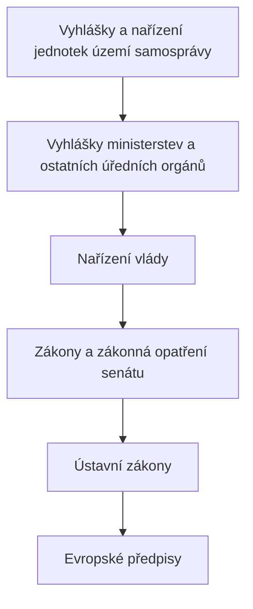

# Prendaska 1 – Právo, pojem práva, dualismus, prameny práva a právní systémy, právní řád ČR, právní norma

---

### Obsah předmětu:
- Co je právo a proč je základem společnosti

- Systém práva: komplexní a dynamický organismus

- Vliv práva na naše každodenní rozhodování

-  Od morálních norem ke státem vynutitelným pravidlům

---

### Právo a jeho význam ve společnosti:

- Právo vzniklo jako historický fenomén, když se společnost začala organizovat a potřebovala vnitřní řád

- Mezilidské vztahy od samého počátku pospolitého života si vynucují určitá pravidla chování

- Pravidla chování, která byla původně nepsaná a zvyková, se postupně vyvinula v závazné a vynutitelné právní normy

- Dnes má právo psanou formu a řídí společenské vztahy podle jasně stanovených pravidel

___
### Historické kořeny práva:
- ___Starověké právo___ – Chamurappiho zákoník a jeho odkaz

- ___Římské právo___ – základ moderních právních systémů

- ___Soukromé a veřejné právo___ – rozdělení, které přetrvalo

- Jak se ze zvykového práva stalo právo psané?

- Státy a právo: cesta od chaosu k řádu

---

### Právní systém:
Jak je právo organizováno?

- Právní systémy většiny zemí světa je dnes založen na jednom ze tří velkých a hlavních typů právní kultury (nebo na jejich kombinaci).

- Jsou to: kontinentální evropské právo, angloamerické právo, a islámské právo

### Právní systémy:
Velké právní systémy světa

1. Kontinentální (evropské) právo:
 
   - Základem je recepce římského práva.
   - Pramenem práva je právní předpis, jedná se o právo psané
   - Soudy aplikují existující právní normy.

2. Angloamerické (ostrovní) právo:

   - Základem je nalézání práva soudy.
   - Pramenem práva je soudní precedent.
   - Soudy právo neustále dotvářejí
   
3. Právo islámské (neměnné právo boží, zvané šarija) – v některých státech Blízkého a Středního východu a v některých státech Afriky (islámských):

   - Úprava práva rodinného, dědického, darovacího apod. Právo závazkové se zpravidla řídí právem převzatým – kontinentálním nebo angloamerickým
   - Systém tradičních a náboženských práv - především v některých afrických zemích.
   - Základem jsou především právní obyčeje a náboženská pravidla chování. Nejsou převažujícím ani jediným systémem, existují paralelně vedle systémů zavedených bývalými koloniálními mocnostmi. Dnes mají význam pouze v otázkách osobního statutu osob daného náboženského vyznání ( Indie, některé arabské země, Izrael apod.).
   
___

### Dualismus práva – jeho různé podoby:
__Dualismus práva = „dvojí pohled na právo“__
- Přirozené vs. pozitivní právo: filozofie a praxe.

- Subjektivní a objektivní právo: kdy jsme účastníkem?

- Hmotné vs. procesní právo: věc nebo procedura?

- Soukromé a veřejné právo – osobní vztahy vs. veřejný zájem.

- Relativní a absolutní právo – vztahy "mezi stranami" nebo "mezi všemi".

- Přirozené právo: Soubor principů vycházejících z přirozených práv člověka.

- Pozitivní (platné) právo: Soubor norem vydaných státem, jejichž dodržování je státem vynucováno.

- ___Objektivní právo___: Souhrn nebo systém platných právních norem, jejichž plnění je vynutitelné státní mocí. Je totožné s právním řádem konkrétního státu

- Právní řád konkrétního státu = souhrn všech právních norem, které jsou v daném časovém období na území konkrétního státu platné (objektivní právo)

- ___Subjektivní právo___: Oprávnění jednotlivce vyplývající z právní normy (objektivního práva). Subjektivní právo je jinak řečeno zákonem garantovaná míra možného chování subjektu, adresáta právní normy (člověk, právnická osoba – obchodní společnost)

- Subjektivní právo je to, co adresát právní normy (objektivního práva) může učinit (jak může jednat), neboť mu to objektivní právo dovoluje

- ___Hmotné právo___: Upravuje společenské vztahy po stránce věcné

- ___Procesní právo___: Stanovuje postupy v různých typech řízení před státními orgány
### Právo soukromé vs právo veřejné ?
- ___Právní normy soukromého práva___: Upravují vztahy mezi fyzickými a právnickými osobami na principu rovnosti a nezávislosti.

- Tyto vztahy vznikají zpravidla na základě projevu vůle účastníků, přičemž je typický smluvní princip.
  
- Občan může jednat tak, jak mu zákon nezakazuje, a není povinen činit to, co mu zákon neukládá.
### Právní normy veřejného práva:
- Upravují vztahy, kde subjekt veřejného práva (zejména státní orgán – např. soud nebo správní orgán) vnucuje svou vůli druhému účastníku na základě svrchovanosti veřejné moci.

- Oblast veřejných zájmů, které stát reprezentuje, je v demokratické společnosti přesně vymezena.

- Státní orgány jsou vázány zákonem a mohou jednat pouze v jeho mezích.
### Právo relativní a právo absolutní:
- ___Relativní právo___: Subjektivní právo účastníka právního vztahu, kterému odpovídá konkrétní povinnost jiného nebo více individuálně určených účastníků. Platí zásada „inter partes“ – mezi stranami.

- ___Absolutní právo___: Odpovídá mu povinnost neurčeného počtu subjektů nerušit oprávněného ve výkonu jeho práv. Toto právo působí „erga omnes“ – vůči všem.

___
### Prameny práva, právní normy, právní řád:
Co je pramenem práva?
- __Pramen práva__: forma objektivního práva, která obsahuje právní normy, liší se v závislosti na právním systému a kultuře, v níž jsou aplikovány v každém státě jsou obvyklé určité druhy či typy pramenů práva (každý stát má unikátní kombinaci pramenů práva) v rámci vývoje státu se zformovaly určité základní typy pramenů práva:

1. ___normativní právní akty (např. zákony a nařízení)
 
2. ___soudní rozhodnutí, precedenty (rozhodnutí soudu, která následně tvoří pravidla)
 
3. ___právní obyčeje (historicky nejstarší pramen práva)

4. ___normativní smlouvy

### 1. normativní právní akty:
   _Normativní právní akty (obecně závazné právní předpisy) = soubory právních norem vydané orgánem veřejné moci v náležité formě
   
   - Základní a zcela převažující pramen práva v České republice

   - Typický pramen práva pro kontinentální evropský systém

   - Výsledkem právotvorné činnosti státních orgánů, které mají pravomoc vydávat, měnit nebo rušit právní normy zákonodárného  nebo jiného obdobného orgánu

   - K platnosti normativního právního aktu musí být stanoveným způsobem vyhlášen.

   - Pozn.:  Normativní právní akty patří spolu s normativními smlouvami (včetně mezinárodních smluv) a nálezy Ústavního soudu mezi absolutně závazné prameny práva v České republice
   
   _Podle postavení orgánu (v soustavě státních orgánů), který normativní právní akt vydal, rozlišujeme: původní a odvozené normativní právní akty:
   
   - Primární právní předpisy mají nejvyšší stupeň právní síly

   - Původní (primární) normativní právní akty:
     I. Ústava a ústavní zákony (přijímá parlament ČR oběma komorami)
     
     II.zákony (přijímá Poslanecká sněmovna, určité schvalovací funkce náleží Senátu a Prezidentu republiky)
     
     III.zákonná opatření Senátu (přijímá senát v době, kdy Poslanecká sněmovna nevykonává své pravomoci)
     
      IV.obecně závazné vyhlášky obecních a městských zastupitelstev a obecně závazné vyhlášky krajů

   _Odvozené (sekundární normativní právní akty):
   - normativní právní akty orgánů výkonných a orgánů státní správy

   - nižší právní síla

   - nesmí odporovat normativním právním aktům od nichž jsou odvozeny

   - slouží k podrobnější právní úpravě věcí v zásadě upravených primárními  normativními akty
   
   Mezi odvozené normativní právní akty patří:
   - ___vládní nařízení___ (vláda ČR je Ústavou generálně zmocněna vydávat k zákonům prováděcí nařízení)
   - ___vyhlášky, popř. další obecně závazné předpisy ministerstev a ústředních orgánů státní správy___ (lze je vydávat pouze na základě výslovného zmocnění uvedeným v konkrétním zákoně)
   - ___vyhlášky, popř. další předpisy ČNB___, vydávané na základě zmocnění zákonem
   - ___nařízení obcí a krajů___ jako normativní právní akty v přenesené působnosti
   
   Znaky normativních právních aktů:
   - Forma – NPA výsledkem záměrné činnosti orgánu veřejné moci s legislativní pravomocí. Vzniká náležitou legislativní procedurou, která je zakončena náležitou publikací. Pouze takový NPA, který splní uvedené požadavky, se může stát platným a účinným

   - Normativita – NPA obsahují pravidla. 

   - Abstraktnost – Pravidla stanovená NPA jsou obecného charakteru. Neukládají práva a povinnosti konkrétním osobám, ale obecně stanovují, jak je třeba - nebo jak je naopak zapovězeno - postupovat v určité typově určené situaci.

   - Obecná závaznost – Zavazuje všechny osoby v působnosti orgánu, který daný NPA vydal.
### 2. Normativní smlouvy:
- Smlouva = dvoustranné či vícestranné právní jednání

- pramenem práva (tzv. nabývá normativního významu)* se stává teprve v okamžiku, pokud tato smlouva reguluje určitou skupinu případů stejného druhu

- Prameny práva (normativními smlouvami) jsou pouze:
	1. kolektivní smlouvy uzavřené mezi zaměstnavateli a odbory (vnitrostátní) a
	
	2. smlouvy mezinárodní, pokud jsou „převzaty“ do vnitrostátního práva 

###### * Normativnost znamená, že dané chování je normováno v podobě abstraktního pravidla

### 3. Nálezy Ústavního soudu:
Nález Ústavního soudu ČR:
- Důsledkem pravomoci nejvyššího orgánu, Ústavního soudu ČR, jako “ochránce ústavnosti“

- Nálezy jako určitá forma rozhodnutí Ústavního soudu ČR dotvářejí již existující formální soustavu pramenů práva v ČR (tj. NPA a normativní smlouvy)
-  _Např. Dojde-li Ústavní soud v rámci řízení k závěru, že zákon nebo jeho jednotlivá ustanovení jsou v rozporu s ústavním zákonem, rozhodne nálezem, a takový právní předpis nebo jejich jednotlivá ustanovení zruší dnem, který je v nálezu stanoven._

---

### Právní obyčej
##### Prameny práva (angloamerický systém):
- patří k historicky nejstarším pramenům práva, v ČR pouze výjimečně (obchodní zvyklosti)

- Zvykové právo je právní systém založený na právních obyčejích, které se v určitém společenství ustálily a jsou všeobecně uznávány a dodržovány.

- Je pramenem práva pouze za předpokladu, že předmětné pravidlo chování je státem uznáno a následně aplikováno státními orgány na konkrétní případy a v případě porušení je následuje sankce.
#### Soudní precedenty:
- rozhodnutí soudu nebo jiného státního orgánu, kterým se řeší situace, která nebyla právem dosud regulována, tedy jedná se o první řešení daného případu, dosud právem neupraveného.

- Podstatou je skutečnost, že toto první posouzení se do budoucna stává právně závazným pro všechny případy stejného druhu

- charakteristické pro angloamerický systém nebo mezinárodní právo

---

### Právní normy:
Co jsou právní normy?:
- základní jednotka právního normativního aktu

- pravidlo chování, které se vyznačuje:
 1. všeobecnou závazností,

2. normativností (dané chování je normováno v podobě abstraktního pravidla) a

3. je vynutitelné státní mocí 
__Základní členění právních norem: kogentní a dispozitivní__:
- ___Kogentní právní norma___ – taková právní norma, u níž není možné se odchýlit, typické zejména pro právo veřejné.

- označení pro jeden obecný příkaz, zákaz nebo dovolení vyplývající z právního řádu včetně nástrojů a zmocnění k jeho dosažení nebo vymáhání. Druhy: přikazující, zakazující, opravňující.

- ___Dispozitivní právní norma___ – taková právní norma, u které se lze odchýlit od pravidla chování obsaženého v dispozici normy, typické pro soukromé právo

__Struktura právní normy__:
Právní norma má následující tříčlennou strukturu:
- ___hypotéza___ vyjadřuje podmínky, za kterých se má realizovat vlastní pravidlo chování, je zde vymezen okruh adresátů normy, čas a působnost

- ___dispozice___ upravuje vlastní pravidlo chování. Tato část právní normy může subjektům něco přikazovat nebo zakazovat anebo je k nějakému jednání opravňovat. Nastupuje za předpokladu, že nastaly okolnosti stanovené v hypotéze

- ___sankce___ je předem stanovený následek za to, že nebyla dodržena dispozice právní normy. Nemusí představovat pouze trest, ale může jí být například povinnost nahradit škodu. Sankce může plnit několik funkcí (preventivní, nahrazovací, represívní)
___Příklad:___
- V právním řádu nalezneme všechny tři části v jediném ustanovení pouze výjimečně, často bývají rozptýleny v rámci určitého právního předpisu

- příklad hypotézy: ___kdo najde ztracenou věc___, je povinen ji vydat vlastníkovi (§ 135 OZ)

- příklad dispozice: kdo najde ztracenou věc,___je povinen ji vydat vlastníkovi___ (§ 135 OZ)

- příklady sankce: náhrada újmy, úroky z prodlení (v případě prodlení s plněním dluhu, atp.)

___Další členění právních norem___:
- přikazující (ukládají subjektům povinnost chovat se určitým způsobem)
	 _Příklad: § 9 odst. 1 písm. a) zákona č. 361/2000 Sb. Přepravovaná osoba je povinna užívat za jízdy na motocyklu nebo mopedu ochrannou přílbu schváleného typu podle zvláštního právního předpisu, kterou má nasazenou a řádně připevněnou na hlavě)_
- zakazující (stanovuje povinnost zdržet se určitého chování, respektive neuskutečnit určité chování vyjádřené daným zákazem)
     _Příklad: § 9 odst. 5 Přepravovaná osoba nesmí vyhazovat předměty z vozidla._
- opravňující (formuluje určité oprávnění, tj. možnost subjektu chovat se určitým právně relevantním způsobem, aniž je k tomu povinen) Příklad: §11 OZ (právo fyzické osoby na ochranu osobnosti)
- deklaratorní (vyjadřují principy či deklarují politické, sociálně ekonomické, etické či jiné cíle a postuláty) 
     _Příklad: § 1 odst. 1 OZ_

---

### Působnost právních norem:

- Při  používání právních předpisů je třeba na začátku vždy vyhodnotit:
	1. územní obvod na kterém norma působí
	2. okruh vztahů, na které se norma vztahuje
	3. okruh subjektů, kterých se norma týká
	4. platnost a účinnost právního předpisu.
- ___Působnost právních norem___ – vymezení dopadu norem z hlediska prostorového, časového, věcného či osobního.
- Působnost právních norem:
	- Místní (také prostorová) vymezuje území, na kterém právní předpis platí, rozlišujeme: a) celostátní (zákony), b) omezenou (vyhlášky obce)
	- Osobní
	- Věcná
	- Časová
	
	- Platnost  x  účinnost právních norem

___
### Právní řád České republiky:
Souhrn všech platných a účinných pramenů práva na území daného státu:
- Právní řád České republiky je ___tvořen všemi právními předpisy ČR a v nich obsaženými právními normami___
- Nejdůležitějšími právními předpisy jsou zákony, tj. soubory pravidel chování upravující základní oblasti života člověka a společnosti.
- Právní předpis je soubor právních norem, který je vydaný státem uznanou formou

Právní normy jako základní a hlavní pramen práva v České republice jsou obsaženy v obecně závazných právních předpisech.

Tyto obecně závazné předpisy se vzájemně odlišují podle různých kriterií:

- podle stupně právní síly

- podle orgánu, který právní předpis vydává

- podle formy právního předpisu.

__Druhy právních předpisů v českém právním řádu__:
- Právní normy jako základní a hlavní pramen práva v České republice jsou obsaženy v obecně závazných právních předpisech.

- Tyto obecně závazné předpisy se vzájemně odlišují podle různých kriterií:

- podle stupně právní síly

- podle orgánu, který právní předpis vydává

- podle formy právního předpisu.

__Mezinárodní právo ČR:
- mezinárodní právo veřejné – reguluje mezinárodní vztahy mezi veřejnými subjekty jako jsou státy a mezinárodní organizace

- mezinárodní právo soukromé – reguluje mezinárodní vztahy mezi soukromými osobami.

__Právo EU:
- Evropská unie má  rámcová pravidla pro jednotlivé typy společenských vztahů
- Povinností všech členských států je tzv. sladit svůj právní řád s normami EU.
- Důvodem je splnění požadavku průchodnosti vztahů mezi subjekty za relativně stejných právních podmínek.
- §Právo primární, sekundární

### Publikace pramenů práva:
Dva publikační způsoby v České republice:
- ___Sbírka zákonů – publikovány zákony___, nálezy Ústavního soudu, rozsudky Nejvyššího správního soudu, sdělení Ústavního soudu, usnesení Poslanecké sněmovny o zákonném opatření Senátu apod

- Podmínkou platnosti a účinnosti převážné většiny obecně závazných  právních předpisů, s výjimkou předpisů územní samosprávy, je jejich publikování ve Sbírce zákonů (při citaci se uvádí zkratka Sb.).

- Platnost vs. účinnost: kdy právo platí a kdy působí.

__Sbírka mezinárodních smluv__:
Ve Sbírce mezinárodních smluv  se vyhlašují sdělením Ministerstva zahraničních věcí :
- platné mezinárodní smlouvy, jimiž je Česká republika vázána,

- oznámení a výpovědi mezinárodních smluv,

- rozhodnutí přijatá mezinárodními orgány a orgány mezinárodních organizací, jimiž je Česká republika vázána.

- Při citaci se užívá zkratky  Sb.m.s.

__Aplikace a interpretace právních norem__:
- stanovit problém

- vymezit právní úpravu

- aplikovat právní normu a stanovit řešení.

- Analogie podle zákona (použití norem které řeší obdobné otázky)

- Analogie podle práva )nejsou ani obdobné právní normy, řeší se podle právních zásad)

