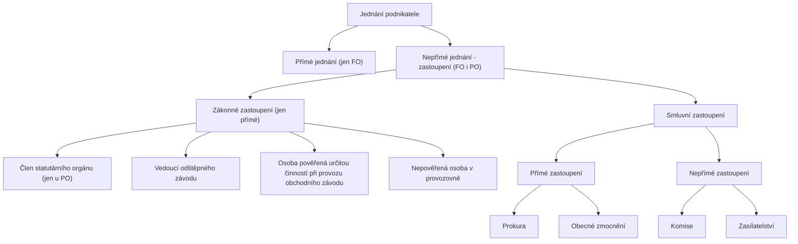

### Právní vztahy,  jejich předpoklady a prvky, právní skutečnosti, subjekty, předmět, ochrana subjektivních práv

___ 
## Právní vztahy:
#### Právní vztahy:
- veškeré vztahy mezi subjekty jsou vztahy společenskými,

- pokud jsou regulovány právní normou, jedná se o vztahy právní,

- právní vztah je tedy společenský vztah upravený právní normou,

- předpokladem existence, vzniku, změny nebo zániku právního vztahu je existence právní normy a dále právní skutečnosti, se kterou se vznik, změna nebo zánik právního vztahu spojen,

- každý právní vztah má své prvky, tj. objekt, subjekt a obsah právního vztahu.
#### Předpoklady právního vztahu:
- předpokladem existence právního vztahu je existence právní normy, která daný společenský vztah upravuje (např. občanský zákon – převod nemovitosti),

- dalším předpokladem je právní skutečnost, na základě které dochází ke změně, vzniku, nebo zániku konkrétního právního vztahu.
#### Právní skutečnosti:

- ___Závislé na lidské vůli (subjektivní):___

- jednání v souladu s právní normou, tj. právní,

- jednání porušující právní normu, tj. protiprávní, (protiprávní jednání je právem sankcionováno, jednat protiprávně lze tím, že subjekt koná i tím, že neučiní nic ve chvíli, kdy mu konání právní norma přikazuje, tzn., že konat opomene.

- ___Na lidské vůli nezávislé (objektivní)___

#### Rozlišujeme čtyři typy právních skutečností:

- právní jednání – projev vůle, který je v souladu s objektivním právem – právní úkony (např. uzavření smlouvy, podání výpovědi, sepsání závěti, podání odvolání) a individuální právní akty (rozhodnutí státních orgánů),

- protiprávní jednání – projev vůle, který je v rozporu s objektivním právem – spáchání trestného činu, přestupku, porušení smluvní povinností,

- právní událost – mimovolní skutečnost v souladu s objektivním právem (narození, smrt, čas - nárok na starobní důchod),

- protiprávní stav – mimovolní skutečnost v rozporu s objektivním právem (živelní pohromy, nemoc, pracovní úraz),
#### Právní úkony:

- projev vůle ve vnějším světě,

- aby se jednalo o projev vůle s nímž jsou spojeny právní následky musí být právní úkon učiněn ___svobodně, vážně, určitě a srozumitelně,___

- ___všechny tyto podmínky musí být splněny kumulativně, jinak je právní úkon neplatný (rozlišujeme absolutní  a relativní neplatnost),___

- ___výslovné___ – právní úkon je učiněn ústně či písemně,

- ___konkludentní___ – vysloven mlčky,

- ___jednostranné___ – např. výpověď, závěť, vydědění

- ___dvoustranné___ – skládají se z 2 právních úkonů (smlouva)

- ___vícestranné___ – smlouva má více stran (účastníků)

#### Dle projevu vůle:

- ___konáním___

	- výslovně – ústně nebo písemně
	- konkludentně – jinak než výslovně, ale musí jít o projev vůle (kývnutí hlavou na souhlas, roztrhání listiny, cestující nastupující do tramvaje uzavírá smlouvu o přepravě, koupě zboží z automatu),

- ___nekonáním___

- ___úplatné___ - kupní smlouva,

- ___bezplatné___ - darovací smlouva,

- ___smíšené___ - sice úplatné, ale za cenu symbolickou,

- ___pojmenované (nominátní)___ – často se opakují, mají své konstantní pojmenování, podrobnou úpravu (smlouvy kupní, nájemní, o dílo),

- ___nepojmenované (inominátní)___ – zákonem neupravené, atypické, nesmí odporovat obsahu nebo účelu Obchodního či Občanského zákoníku,

#### Prvky právního vztahu:

 - I. Subjekt:

	- fyzické osoby:
	- způsobilost mít práva a povinnosti = nově právní osobnost – od narození do smrti, nelze omezit nebo odejmout; (§ 15 odst. 1. NOZ)
	- způsobilost k právním úkonům – Svéprávnost - vzniká zletilostí /18 let, lze i dříve v 16 letech s přivolením soudu/, lze odejmout /duševní příčiny, soud, zástupce/),  (§ 15 odst. 2. NOZ)
	- způsobilost k protiprávním úkonům (deliktní způsobilost) – způsobilost činit právní úkony a být za ně zodpovědný (15 let),

- Právnická osoba:

	- umělá, fiktivní osoba vytvořená právem
	- obchodní společnost (a.s., s.r.o., k.s., v.o.s.), veřejné VŠ, sdružení FO nebo PO (družstvo), komory jako nucené profesní korporace a další (ČT, ČRo) atd.
	- vzniká buď ze zákona (obce, kraje, česká televize...) nebo na základě zákona (zřizovací smlouva, zápis do rejstříku)

#### Právnickými osobami mohou být:

- různá sdružení osob – korporace,

- majetkové celky, které mají samostatnou právní existenci – nadace,

- jednotky území samosprávy,

- jiné subjekty o nichž to stanoví zákon,

- II. Objekt:

	- věci, práva, vynálezy, ochrana osobnosti atd. = to, k čemu vzájemná práva a povinnosti subjektů směřují

- III. Obsah:

	- práva (oprávnění znamená, že se subjekt právního vztahu může chovat určitým způsobem) a povinnosti účastníku tohoto vztahu (práva jedné strany odpovídají povinnostem druhé strany a obráceně – vzájemná podmíněnost) – povinnosti: něco dát, konat, zdržet se, strpět

---
### Jednání fyzické osoby:

**Svéprávnost**

- **Zletilost**
    
    - dovršení 18. roku věku
        
    - přiznání svéprávnosti - § 37
        
    - uzavření manželství
        
- **Nezletilí**
    
    - Právní jednání přiměřené rozumové a volní vyspělosti
        
    - Souhlas zák. zástupce k urč. pr. jednání
        
    - Souhlas k samost. provozování obch. závodu nebo k jiné obdobné výdělečné činnosti - § 33
        

K platnosti souhlasu se vyžaduje přivolení soudu Souhlas nahrazuje podmínku věku stanovenou jiným právním předpisem

## Zastoupení

- **Statutární orgán - § 163**
    
    - Ve všech záležitostech - § 164
        
    - Více osob → kolektivní statutární orgán
        
        - **Způsob jednání:**
            
            - každý samostatně
                
            - společně, možnost zmocnění
                

---

- **Zástupce → Zastoupení**
    
    - **Smluvní:**
        
        - zmocněnec na základě plné moci - § 441
            
    - **Zákonné:**
        
        - Zaměstnanci - § 166
            
        - Člen nebo člen orgánu nezapsaného do veřejného rejstříku
            
            - V rozsahu obvyklém vzhledem k zařazení nebo funkci
                
    - **Opatrovnictví:**
        
        - Opatrovník k hájení práv a spravování záležitostí - § 486 § 165
            
        - Statutární orgán nemá dostatečný počet členů
            
        - Zájmy člena statutárního orgánu jsou v rozporu se zájmy PO a PO nemá jiného člena statutárního orgánu schopného ji zastupovat
            

---

- **Likvidátor**
    
    - PO v likvidaci, jednání jen v rozsahu podle povahy a cíle likvidace

---

### Právní vztahy – Právní jednání:
- Zásady a principy (změny oproti dosavadní právní úpravy)

- NOZ striktně drží terminologii- odvrací se od dosavadního termínu právního úkonu, jako slovakizmu a navrací se k římskoprávním tradicím pojmu negotium (jednání)

- Dochází ke změně některých zásad a principů:

- NOZ výslovně neobsahuje! zásadu rovnosti stran/osob

	- –Zásada rovnosti zastírá přirozenou nerovnost fyzických a právnických osob, neboť právně mezi nimi nemůže být nikdy rovnost dosažena
	- –Pomíjená taky ochrana slabší strany, kdy předešlá úprava soukromého práva vedla k rozbití základního principu, uznaného i ústavním pořádkem, že přirozená svoboda člověka má přednost před státem, a tedy že stát není tvůrcem svobody člověka, nýbrž její ochráncem = z tohoto pojetí vychází hledisko autonomie vůle

---

### Právní vztahy:
- Zásada autonomie vůle- každý má mít možnost rozhodnout se s kým/jak/kdy jednat a za jakých podmínek

	- –Základním soukromoprávním nástrojem je konsenzus dvou osob/stran
	- –Smlouvě a smluvní svobodě se ponechává rozsáhlý prostor
	- –Zákon vystupuje jako ultima ratio jen v případě, že dohoda vůbec není možná, nebo nedojde-li k ní

- Další všeobecné soukromoprávní zásady- §3 odst. 2 NOZ

- ___§4 NOZ - průměrný člověk- NOZ stanovuje, že každá svéprávná osoba má rozum průměrného člověka i schopnost užívat jej s běžnou péči a opatrností = při právním styku je možné od každé osoby toto očekávat___

- hledisko, že osoba něco měla a mohla vědět je značně objektivizováno, aby se stanovila minimální předvídatelnost a schopnost vyhodnocení

- ___§5 NOZ – „kdo se veřejně nebo ve styku s jinou osobou přihlásí k odbornému výkonu jako příslušník určitého povolání … , dává tím najevo, že je schopen jednat se znalostí a pečlivostí, která je s jeho povoláním … spojena…“- úprava významná hlavně v oblasti náhrady škody___

#### Zdánlivé právní jednání (§551 a násl. NOZ):

- Můžeme přirovnat k dnešní nicotnosti právního úkonu

- O právní jednání se nejedná, chybí-li vůle jednající osoby, nebo nebyla-li zjevně vážná vůle projevena

- Institut se zabývá zkoumáním vůle a jejich projevů

- O právní jednání nejde taky v případě, jestli se nedá zjistit pro neurčitost nebo nesrozumitelnost jeho obsah nebo výklad

- avšak byl-li projev vůle mezi stranami dodatečně vyjasněn, nepřihlíží se k jeho vadě a hledí se, jako by tu bylo právní jednání od počátku (§ 553 odst. 2 NOZ)

- k zdánlivému právnímu jednání se nepřihlíží

#### Výklad právního jednání (§ 555 a násl. NOZ):

- ___Důraz kladen na svobodnou vůli: „Právní jednání se posuzuje podle svého obsahu“ a ne podle slov___

- Posouzení obsahu není věcí volné dispozice právně jednajících osob- proto je nutné stanovit pravidla pro daný výklad

- Vždy se zkoumá obsah, není možné vnutit stranám jiný obsah/výklad, jedině při zastřeném jednání se posoudí podle jeho pravé povahy (zastřené jednání- které má být zastřené jiným právním jednáním)- §555 odst. 2 NOZ

- § 557 NOZ- „připouští-li použitý výraz různý výklad, vyloží se v pochybnostech k tíži toho, kdo výrazu použil jako první.“ - většina základních pojmů upravena v NOZ a ne v ZOK

- Oproti dosavadní úpravě se tedy klade větší důraz na skutečnou vůli jednajících osob a opouští se od formálního hlediska projevu

#### Forma právního jednání (§559 a násl. NOZ):

- §559 NOZ určuje právo zvolit si libovolnou formu právního jednání, není- li omezení zákonem

- §560 NOZ- písemná forma se vyžaduje pro zřízení nebo převod (taky pro změnu nebo zrušení) věcného práva k nemovité věci- projev vůle všech účastníků na téže listině

#### Neplatnost právního jednání (§574 a násl. NOZ):

- Nová úprava opouští dosavadní koncept absolutní neplatnosti (absolutní neplatnost nastává jenom v určitých případech)

- Jednání je spíše platné než neplatné

#### Absolutní neplatnost:

- Definice: Absolutní neplatnost znamená, že právní jednání je od počátku neplatné a nemá právní účinky, jako by vůbec nevzniklo.

- Důvody: K absolutní neplatnosti dochází v případě, že právní jednání:

	- Zjevně porušuje dobré mravy.
	- Porušuje zákon, pokud smysl a účel dané normy vyžaduje, aby dané jednání bylo absolutně neplatné (typicky u právních úkonů v rozporu s veřejným pořádkem, na ochranu nezletilých apod.).
	- Jedná se o právní jednání zjevně se příčící veřejnému pořádku.

- Účinky: Absolutní neplatnost působí ex tunc, což znamená, že právní jednání je považováno za neplatné od samého počátku.

- Náprava: Nelze dodatečně zhojit. Absolutní neplatnost může být namítána kýmkoli a soud k ní přihlíží z úřední povinnosti.

- Příklad: Smlouva o prodeji lidských orgánů by byla absolutně neplatná, protože je v rozporu s dobrými mravy a veřejným pořádkem.

#### Relativní neplatnost:

- Definice: Relativní neplatnost znamená, že právní jednání je neplatné pouze vůči konkrétní osobě, a to z důvodu, že tato osoba má zájem na ochraně svých práv.

- Důvody: K relativní neplatnosti dochází například v případech, kdy právní jednání:

	- Bylo učiněno v tísni nebo za nápadně nevýhodných podmínek.
	- Bylo uzavřeno osobou, která nebyla plně svéprávná (ale která nebyla zcela zbavena svéprávnosti).
	- Bylo uzavřeno v omylu ohledně podstatných náležitostí smlouvy.

- Účinky: Relativní neplatnost působí ex nunc, což znamená, že se uplatňuje od okamžiku, kdy oprávněná osoba neplatnost namítne. Jinak právní jednání zůstává platné.

- Náprava: Relativní neplatnost lze zhojit, pokud osoba, které relativní neplatnost svědčí, jedná způsobem, z nějž plyne, že na neplatnosti netrvá (např. dodatečným souhlasem). Soud k ní nepřihlíží z vlastní iniciativy a musí být namítnuta dotčenou stranou.

- Příklad: Pokud prodávající v omylu uvede, že prodává auto, které nebylo havarováno (a kupující kvůli tomu uzavřel smlouvu), má kupující právo namítnout relativní neplatnost smlouvy a žádat její zrušení. 

Domáhání se absolutní a relativní neplatnosti právního jednání se liší jak v procesním postupu, tak v tom, kdo a jak může neplatnost namítat.

#### Absolutní neplatnost:

- Jak se domáhat:

	- Absolutní neplatnosti ne nutné se aktivně domáhat soudně, protože soud k ní přihlíží z úřední povinnosti (tzv. ex officio).
	- Stačí tedy, když kdokoli (účastník či třetí osoba) upozorní na skutečnost, že právní jednání je absolutně neplatné. Pokud soud zjistí důvod absolutní neplatnosti, musí k tomu přihlédnout automaticky, a to i bez návrhu.

- Kdo může namítat:

	- Absolutní neplatnost může namítat kterákoli osoba (tedy nejen účastníci daného právního jednání, ale i třetí osoby, například orgány veřejné správy).
	- Přihlédne k ní i soud sám o sobě, pokud zjistí, že právní jednání porušuje zákon, dobré mravy nebo veřejný pořádek.

- Způsob nápravy:

	- Soud rozhodne, že právní jednání je absolutně neplatné. Typicky se toto řeší zápůrčí žalobou (pokud se někdo snaží domoci práv z takového neplatného jednání).

#### Relativní neplatnost:

- Jak se domáhat:

	- Relativní neplatnost musí být aktivně namítnuta dotčenou osobou. Pokud oprávněná osoba (např. účastník smlouvy) neplatnost nenamítne, právní jednání zůstane platné a účinné.
	- Namítnutí relativní neplatnosti se nejčastěji realizuje podáním žaloby k soudu (např. žalobou na určení neplatnosti právního jednání).
	- Relativní neplatnost musí být namítnuta v přiměřené lhůtě, což v praxi obvykle znamená do 3 let od okamžiku, kdy se osoba o důvodu neplatnosti dozvěděla (zákonné promlčecí lhůty jsou uvedeny v § 629 a násl. NOZ).

- Kdo může namítat:
	- Pouze osoba, která je oprávněna k ochraně svých práv. Typicky jde o toho účastníka smlouvy, který byl v důsledku určité vady jednání poškozen (např. osoba, která byla uvedena v omyl, osoba jednající v tísni, apod.).

- Způsob nápravy:

	- Soud na návrh oprávněné osoby rozhodne, že právní jednání je relativně neplatné.
	- Pokud osoba relativní neplatnost nenamítne, právní jednání zůstane platné a účinné.

- Zdánlivé právní jednání (nicotné právní jednání)

	- NOZ upouští od masivního konceptu absolutní neplatnosti a zavádí tzv. nicotnost zdánlivého právního jednání
	- Nicotné je právní jednání, které nesplňuje náležitosti právního jednání požadované zákonem (§§ 551 – 554)
	- Ke zdánlivému právnímu jednání se nepřihlíží (§ 554), tzn., hledí se na něj jako by jednáno vůbec nebylo; Byl-li však projev vůle mezi stranami dodatečně vyjasněn, nepřihlíží se k jeho vadě a hledí se, jako by tu bylo právní jednání od počátku (konvalidace)

- O zdánlivé právní jednání jde pokud:

	•chybí vůle jednající osoby
	•nebyla vůle zjevně projevena
	•pro neurčitost nebo nesrozumitelnost nelze zjistit obsah ani výkladem
	•zákon stanoví, že se k určitému jednání nepřihlíží

 - Právní jednání (§545 a násl. NOZ)

	- NOZ právní jednání jednoznačně nedefinuje, jedná se o právní skutečnosti, které vyvolávají právní následky, které jsou v něm vyjádřeny, jakož i právní následky plynoucí ze zákona, dobrých mravů, zvyklostí a zavedené praxe stran
		- –Pr. jednáním tak bude např. i rozhodnutí valné hromady/ rozh. jediného společníka oprávněného jednat za společnost

- NOZ rozlišuje náležitosti nezbytné pro vznik právního jednání a ty, které jsou nezbytné pro platnost pr. jednání

	- –Vznik: musí se jednat o vážnou, dostatečně srozumitelnou a určitou vůli jednajícího
	- –Platnost: náležitosti subjektu (svéprávnost), náležitost projevu (forma), náležitost vůle (absence omylu, svoboda) a náležitost předmětu (dovolenost a možnost)

- Právně lze jednat konáním nebo opomenutím; výslovně nebo jiným způsobem nevzbuzujícím pochybnost o tom, co jednající osoba chtěla projevit (§546 NOZ)- kývnutí,..
- Nový občanský zákoník (NOZ), označovaný jako zákon č. 89/2012 Sb., je základním právním předpisem upravujícím soukromé právo v České republice.
- NOZ vstoupil v účinnost dne 1. ledna 2014 a nahradil původní občanský zákoník z roku 1964. Jeho cílem bylo modernizovat, sjednotit a zpřehlednit úpravu občanského práva a lépe reflektovat změny ve společnosti a praxi.

#### Hlavní cíle NOZ:

- 1. Kodifikace a sjednocení soukromého práva (tj. sloučení různých oblastí, jako je občanské, rodinné a obchodní právo, do jednoho právního předpisu).

- 2. Posílení smluvní autonomie a svobody právních jednání.

- 3. Ochrana slabší strany (zejména spotřebitelů, nezletilých a osob se sníženou schopností právního jednání).

- 4. Reflexe moderních hodnot (např. ochrana lidské důstojnosti a osobnosti).

- 5. Respekt k tradičním právním principům a návrat k prvorepublikové právní úpravě (občanský zákoník z roku 1937), což je vidět zejména v terminologii a systematice zákoníku.

- NOZ významně ovlivnil praxi jak v oblasti občanského práva, tak i v obchodních vztazích.
- Představuje moderní a flexibilní právní nástroj, který se snaží více přizpůsobit skutečným potřebám a zájmům lidí a podnikatelů.

#### Základní principy NOZ:

- Nový občanský zákoník je postaven na několika základních zásadách, které vyjadřují jeho filozofii a cíle.

- Tyto zásady se uplatňují nejen při výkladu zákonných ustanovení, ale také při rozhodování soudů a právních jednání:

	- 1.Zásada autonomie vůle (smluvní svobody):
		- Umožňuje účastníkům soukromoprávních vztahů, aby si dohodli vlastní pravidla a svobodně upravili svá práva a povinnosti.
		- Omezení smluvní svobody je možné jen v případech, kdy to zákon výslovně stanoví (např. ochrana slabší strany).
	- 2.Zásada poctivosti a dobré víry:
		- Každý má jednat poctivě a v dobré víře.
		- Zákaz zneužití práva (nelze se dovolávat práva, pokud by šlo o zjevnou nespravedlnost).
	- 3.Zásada ochrany dobrých mravů a veřejného pořádku:
		- Právní jednání nesmí být v rozporu s dobrými mravy (tj. společenskými hodnotami) a veřejným pořádkem.
		- Soud přihlíží k těmto zásadám i bez návrhu.
	- 4.Zásada ochrany slabší strany:
		- Zajišťuje, že slabší strany (např. spotřebitelé, nájemci, zaměstnanci) nebudou znevýhodněny.
		- V případě konfliktu je právo interpretováno ve prospěch slabší strany.
	- 5. Zásada právní jistoty a předvídatelnosti práva:
		- Účastníci mají právo spoléhat na stabilitu právního řádu a ochranu svých práv.
		- Výklad právních norem by měl být co nejvíce předvídatelný.
	- 6. Zásada ochrany důstojnosti a osobnosti:
		- Ochrana člověka jako jednotlivce a jeho základních práv a svobod.
		- Zajišťuje respekt k lidské důstojnosti, životu, zdraví, cti, soukromí a rodinnému životu.
	- 7. Zásada pacta sunt servanda:
		- "Smlouvy mají být dodržovány". Strany jsou povinny plnit své smluvní závazky.
		- Důraz na stabilitu smluvních vztahů a závazků.
	- 8. Zásada dispozitivnosti:
		- Většina ustanovení NOZ má dispozitivní povahu, což znamená, že    účastníci si mohou ujednat odlišná pravidla, pokud to zákon nezakazuje.
		- Povinná pravidla (tzv. kogentní normy) se použijí jen v případech, kdy je nutné chránit veřejný zájem, dobrou víru či dobré mravy.

#### Struktura NOZ:
- Občanský zákoník je rozdělen do 5 hlavních částí:

	- 1.Obecná část (§ 1–302) – upravuje základní ustanovení, právní jednání, zastoupení a právnické osoby.
	- 2.Rodinné právo (§ 655–975) – zahrnuje úpravu manželství, rodičovských práv a povinností a jiných příbuzenských vztahů.
	- 3.Absolutní majetková práva (§ 976–1474) – věnuje se vlastnickému právu, věcným právům, držbě a sousedským vztahům.
	- 4.Relativní majetková práva (§ 1721–3014) – smluvní závazky, odpovědnost za škodu, dědické právo.
	- 5.Ustanovení společná, přechodná a závěrečná (§ 3015–3081).

---
### Nové termíny k vlastnictví a dalším věcným právům:
- ROZHRADY – např. ploty, zdi, meze, strouhy.

- PŘIVLASTNĚNÍ – u věci, která nikomu nepatří, dovoluje-li to zákon.

- PŘESTAVEK – přesahuje-li stavba malou částí na cizí pozemek.

- PRÁVO STAVBY – zatížení pozemku stavbou (nemusí existovat).

- SLUŽEBNOST – vlastník věci postiženého služebností musí něco strpět nebo se něčeho zdržet (např. právo okapu, právo pasty, právo na vodu, právo inženýrských sítí).

- BENEFICENT – ten, v jehož prospěch je majetek spravován.

- SVĚŘENECKÝ FOND – trvale se vyčlení majetek, který zůstává bez vlastníka a je spravován správcem za určitým účelem.

- OBMYŠLENÝ – možný příjemce plnění z fondu.

### Nové termíny závazkového práva:
- ZÁVDAVEK - /není záloha/ potvrzuje se jím uzavření smlouvy a je tak poskytována jistota, že závazek bude splněn.

- ODVOLÁNÍ DARU PRO NOUZI – lze požadovat vrácení nebo náhradu v penězích při upadnutí do nouze.

- VÝPROSA – bezplatné a bezúčelné přenechání věci k užívání na neurčitou dobu výprosníkovi.

- PACHT – přenechání věci k dočasnému užívání za pachtovné nebo část výnosu.

- VÝMĚNEK – práva vymíněná vlastníkem nemovitosti v souvislosti s jejím prodejem.

- ODVÁŽNÉ SMLOUVY – prospěch nebo neprospěch závisí na nejisté události – např. pojištění.

### NOZ a zrušené právní předpisy:
- NOZ v § 3080 ruší 238 právních předpisů, a to např.:

	- Zákon č. 40/1964 Sb., občanský zákoník
	- Zákon č. 116/1990 Sb., o nájmu a podnájmu nebytových prostor
	- Zákon č. 513/1991 Sb., obchodní zákoník
	- Zákon č. 94/1963 Sb., o rodině
	- Zákon č. 83/1990 Sb., o sdružování občanů
	- Zákon č. 248/1995 Sb., o obecně prospěšných společnostech a o změně a doplnění některých zákonů
	- Zákon č. 591/1992 Sb., o cenných papírech
	- Zákon č. 72/1994 Sb., kterým se upravují některé spoluvlastnické vztahy k budovám a některé vlastnické vztahy k bytům a nebytovým prostorům a doplňují některé zákony (zákon o vlastnictví bytů).

- Přijaté zákony

	- Zákon č. 89/2012 Sb., Nový Občanský zákoník
	- Zákon č. 90/2012 Sb., o obchodních korporacích
	- Zákon č. 91/212 Sb., o mezinárodním právu soukromém

### Návrh doprovodného zákona:
- novelizace dalších 70 předpisů vyplývajících z rekodifikace soukromého práva (26. 4. 2013 Ústavně právní výbor PS přerušil do 28. 5 . 2013 projednávání návrhu zákona)

- jedná se např. o novelu:

	- živnostenského zákona
	- vodního zákona
	- zákona o cenách
	- zákona o oceňování majetku
	- rozpočtových pravidel
	- zákona o majetku ČR
	- zákona o ochraně spotřebitele
	- zákona o zaměstnanosti
	- zákona o sociálních službách
	- zákona o pomoci v hmotné nouzi
	- zákoníku práce
	- zákona o zdravotních službách
	- zákona o obecní polici
	- zákona o občanských průkazech
	- zákona o cestovních dokladech
	- zákona o evidenci obyvatel
	- zákona o integrovaném záchranném systému
	- krizového zákona
	- zákona o veřejných sbírkách
	- zákona o úřednících územních samosprávných celků
	- zákona o místním referendu
	- správního řádu
	- stavebního zákona
	- zákona o základních registrech
	- zákona o krajském referendu
	- autorského zákona
	- zákona o veřejných dražbách
	- zákona o veřejných zakázkách
	- zákona o střetu zájmů

### Obecné informace k Občanskému zákonu:
- Nový občanský zákoník obsahuje 3 081 paragrafů.

- Nově přejímá celou řadu pravidel upravených v jiných zákonech, které  zrušuje (celkem se jedná o více než 100 právních předpisů, např. obchodní zákoník, zákon o rodině, zákon o vlastnictví bytů či zákon o sdružování občanů).

- Ne všechna pravidla obsažená ve zvláštních zákonech jsou však přijímána bez dalšího.

- Nový kodex se je snaží přizpůsobit moderním potřebám.

- Další snahou je upravit nebo zpřesnit některá pravidla, která současné soukromé právo neřeší, případně je upravuje velmi stroze, a pro praxi jsou tato pravidla potřebná.

- Podle legislativních zvyklostí se jednotlivé části zákonů dělí na hlavy, díly a oddíly.

- Pro lepší přehlednost kodexu byla přijata zásada, že jeden paragraf má obsahovat nanejvýš dva odstavce a že jeden odstavec paragrafu má obsahovat nanejvýš dvě věty. Ne vždy se však danou zásadu podařilo dodržet.

- Příbuzné nebo tematicky spjaté instituty jsou řazeny od jednodušších ke složitějším a od obecných ke zvláštním (nikoli od důležitějších k méně důležitým – hledisko důležitosti je totiž relativní).

- NOZ se snaží vyhnout cizím slovům. Je-li možné nahradit cizí slovo bez obtíží českým, preferuje se takové řešení (např. „zapsaný“ místo „registrovaný“, „nakládat“ místo „disponovat“, „umístění“ místo „instalace“, „sdělení“ nebo „údaj“ místo „informace“ apod.).

- Avšak v těch případech, kde cizí termín v českém právu zdomácněl (např. „orgán“, „forma“, „elektronický“), anebo kde jej lze pro jeho přesný význam využít lépe než výraz původem český (např. „prekluze“, „detence“), nechová se NOZ puristicky.

- NOZ se vrací ke klasické (tradiční) české právní terminologii, od níž se občanské zákoníky z r. 1950 a 1964 postupně odvrátily zavedením jednak některých slovakismů při unifikaci českého a slovenského práva (např. „právní úkon“, „výpůjčka“, „neopomenutelný dědic“), jednak právnických neologismů podmíněných totalitní ideologií nebo na tuto ideologii se odvolávajících (např. „účastník“ místo „osoba“, „způsobilost k právním úkonům“ místo „svéprávnost“, „návrh na uzavření smlouvy“ místo „nabídka“, „smlouva o sdružení“ místo „společenská smlouva“ apod.).

### Fyzické osoby:
- Právní osobnost je způsobilost mít v mezích právního řádu práva a povinnosti  - nahrazuje pojem způsobilost mít práva a povinnosti

- Člověk má právní osobnost od narození až do smrti.

- Svéprávnost je způsobilost nabývat pro sebe vlastním právním jednáním práva a zavazovat se k povinnostem (právně jednat).

- Právní osobnosti ani svéprávnosti se nikdo nemůže vzdát ani zčásti; učiní-li tak, nepřihlíží se k tomu.

- Práva může mít a vykonávat jen osoba. Povinnost lze uložit jen osobě a jen vůči ní lze plnění povinnosti vymáhat.

- Osoba je fyzická, nebo právnická.

- Každý člověk má vrozená, již samotným rozumem a citem poznatelná přirozená práva, a tudíž se považuje za osobu. Přirozená práva spojená s osobností člověka nelze zcizit a nelze se jich vzdát

- Osoba blízká je příbuzný v řadě přímé, sourozenec a manžel nebo partner podle jiného zákona upravujícího registrované partnerství (dále jen "partner"); jiné osoby v poměru rodinném nebo obdobném se pokládají za osoby sobě navzájem blízké, pokud by újmu, kterou utrpěla jedna z nich, druhá důvodně pociťovala jako újmu vlastní.

- Novinky dle Nového Občanského zákona:

	- Plné svéprávnosti nabývá člověk dosažením 18 let (dříve od 16. roku), nebo také sňatkem.
	- Nově bude možné nabytí svéprávnosti také emancipací, je-li nezletilý schopen sám se živit a obstarávat si své záležitosti.
	- Nezletilý tedy může ze své vůle dosáhnout přiznání svéprávnosti, je-li to v jeho zájmu (§ 37).
	- Ve svéprávnosti lze člověka omezit (nikoli úplně zbavit!), avšak jen při vážné duševní poruše, jen na určitý čas (max. 3 roky) a jen rozhodnutím soudu.
	- Nově bude platit, že soudce musí člověka při rozhodování o jeho svéprávnosti shlédnout a že k těmto zásahům do lidských práv lze přistoupit, jen nestačí-li mírnější postup.
	- Kromě toho se zavádí nový institut nápomoci při rozhodování (§ 45), umožňující soudu člověka neomezovat ve svéprávnosti a ustanovit mu osobu, která za člověka právně nejedná, avšak napomáhá mu v běžných činnostech.
- Novinky dle Nového Občanského zákona:

	- Nový občanský zákoník výrazně zesiluje ochranu práv spojených s osobností člověka, jako jsou právo na život, zdraví, osobní svobodu, na jméno, čest, soukromí a další.
	- Porušení těchto práv musí být odčiněno, stejně jako je tomu dnes, zadostiučiněním.
	- Nově se ale dává přednost peněžitému zadostiučinění, které musí být poskytnuto vždy, nestačí-li jiný způsob (např. omluva) skutečnému a dostatečně účinnému odčinění způsobené újmy. 
	- Nový občanský zákoník zvláštními ustanoveními zakládá práva člověku zadrženého ve zdravotnickém zařízení (§ 104–109).
	- Důvod zařazení této úpravy do občanského zákoníku je v tom, že taková opatření zasahují do lidské svobody, a tudíž spadají do rámce ochrany osobnosti víc než do zákona upravujícího ryze specializované profesní činnosti.
- Změna pohlaví:

	- Změna pohlaví člověka nastává chirurgickým zákrokem při současném znemožnění reprodukční funkce a přeměně pohlavních orgánů.
	- Má se za to, že dnem změny pohlaví je den uvedený v potvrzení vydaném poskytovatelem zdravotních služeb.
	- Změna pohlaví nemá vliv na osobní stav člověka, ani na jeho osobní a majetkové poměry; manželství nebo registrované partnerství však zaniká.
	- O povinnostech a právech muže a ženy, jejichž manželství zaniklo, ke společnému dítěti a o jejich majetkových povinnostech a právech v době po zániku manželství platí obdobně ustanovení o povinnostech a právech rozvedených manželů ke společnému dítěti a o jejich majetkových povinnostech a právech v době po rozvodu.
- Přiznání svéprávnosti:

	- Navrhne-li nezletilý, který není plně svéprávný, aby mu soud přiznal svéprávnost, soud návrhu vyhoví, pokud nezletilý dosáhl věku šestnácti let, pokud je osvědčena jeho schopnost sám se živit a obstarat si své záležitosti a pokud s návrhem souhlasí zákonný zástupce nezletilého.

- Omezení svéprávnosti: 

	- K omezení svéprávnosti lze přistoupit jen v zájmu člověka, jehož se to týká, po jeho zhlédnutí a s plným uznáváním jeho práv a jeho osobní jedinečnosti
	- Omezit svéprávnost člověka lze jen tehdy, hrozila-li by mu jinak závažná újma a nepostačí-li vzhledem k jeho zájmům mírnější a méně omezující opatření.
	- Omezit svéprávnost člověka může jen soud.
	- Soud může omezit svéprávnost člověka v rozsahu, v jakém člověk není pro duševní poruchu, která není jen přechodná, schopen právně jednat, a vymezí rozsah, v jakém způsobilost člověka samostatně právně jednat omezil.
	- Má-li člověk obtíže dorozumívat se, není to samo o sobě důvodem k omezení svéprávnosti.
	- Soud může svéprávnost omezit v souvislosti s určitou záležitostí na dobu nutnou pro její vyřízení, nebo na jinak určenou určitou dobu, nejdéle však na tři roky; uplynutím doby právní účinky omezení zanikají.
	- Zahájí-li se však v této době řízení o prodloužení doby omezení, trvají právní účinky původního rozhodnutí až do vydání nového rozhodnutí, nejdéle však jeden rok
	- Změní-li se okolnosti, soud své rozhodnutí bezodkladně změní nebo zruší, a to i bez návrhu.
	- Rozhoduje-li soud o omezení svéprávnosti člověka, může osoba jím povolaná za opatrovníka navrhnout, aby byla opatrovníkem jmenována
- Nezvěstnost:

	- Za nezvěstného může soud prohlásit svéprávného člověka, který opustil své bydliště, nepodal o sobě zprávu a není o něm známo, kde se zdržuje. Soud uvede v rozhodnutí den, kdy nastaly účinky prohlášení nezvěstnosti.
	- Na právní jednání, k němuž došlo bez souhlasu nebo jiného nezbytného projevu vůle nezvěstného poté, co opustil své bydliště, avšak dříve, než byl za nezvěstného prohlášen, přestože toto prohlášení bylo bez zbytečného odkladu navrženo, se hledí jako na jednání učiněné s odkládací podmínkou vydání rozhodnutí, jímž byl prohlášen za nezvěstného
	- Navrátí-li se člověk prohlášený za nezvěstného nebo jmenuje-li správce svého jmění, pozbývá prohlášení za nezvěstného účinků

- Domněnka smrti:

	- Na návrh osoby, která na tom má právní zájem, prohlásí soud za mrtvého člověka, o němž lze mít důvodně za to, že zemřel, a určí den, který se pokládá za den jeho smrti.
	- Byl-li člověk prohlášen za nezvěstného a vyplývají-li z okolností vážné pochybnosti, zda je ještě živ, ačkoli jeho smrt není nepochybná, může ho soud prohlásit za mrtvého na návrh osoby, která na tom má právní zájem, a určí den, který nezvěstný zřejmě nepřežil.
	- Má se za to, že tento den je dnem smrti nezvěstného.
	- Člověka, který byl prohlášen za nezvěstného, lze prohlásit za mrtvého nejdříve po uplynutí pěti let počítaných od konce roku, v němž došlo k prohlášení za nezvěstného.
	- Člověka, který se stal nezvěstný tím, že opustil své bydliště, nepodal o sobě zprávu a není o něm známo, kde se zdržuje, avšak nebyl za nezvěstného prohlášen, lze prohlásit za mrtvého nejdříve po uplynutí sedmi let od konce roku, v němž se objevila poslední zpráva, z níž lze usuzovat, že byl ještě naživu.
	- Člověka, který se stal nezvěstným před dovršením osmnáctého roku věku, nelze prohlásit za mrtvého před uplynutím roku, v němž uplyne dvacet pět let od jeho narození
- Ochrana osobnosti člověka:

	- Chráněna je osobnost člověka včetně všech jeho přirozených práv. Každý je povinen ctít svobodné rozhodnutí člověka žít podle svého.
	- Ochrany požívají zejména život a důstojnost člověka, jeho zdraví a právo žít v příznivém životním prostředí, jeho vážnost, čest, soukromí a jeho projevy osobní povahy.
	- Člověk, jehož osobnost byla dotčena, má právo domáhat se toho, aby bylo od neoprávněného zásahu upuštěno nebo aby byl odstraněn jeho následek.
	- Po smrti člověka se může ochrany jeho osobnosti domáhat kterákoli z osob jemu blízkých.
	- Souvisí-li neoprávněný zásah do osobnosti člověka s jeho činností v právnické osobě, může právo na ochranu jeho osobnosti uplatnit i tato právnická osoba; za jeho života však jen jeho jménem a s jeho souhlasem. Není-li člověk schopen projevit vůli pro nepřítomnost nebo pro neschopnost úsudku, není souhlasu třeba.
- Ochrana podoby a soukromí osoby:

	- Zachytit jakýmkoli způsobem podobu člověka tak, aby podle zobrazení bylo možné určit jeho totožnost, je možné jen s jeho svolením.
	- Rozšiřovat podobu člověka je možné jen s jeho svolením.
	- Nikdo nesmí zasáhnout do soukromí jiného, nemá-li k tomu zákonný důvod.
	- Zejména nelze bez svolení člověka narušit jeho soukromé prostory, sledovat jeho soukromý život nebo pořizovat o tom zvukový nebo obrazový záznam, využívat takové či jiné záznamy pořízené o soukromém životě člověka třetí osobou, nebo takové záznamy o jeho soukromém životě šířit. Ve stejném rozsahu jsou chráněny i soukromé písemnosti osobní povahy.
	- Svolení není třeba, pokud se podobizna nebo zvukový či obrazový záznam pořídí nebo použijí k výkonu nebo ochraně jiných práv nebo právem chráněných zájmů jiných osob.
- Právo na duševní a tělesnou integritu:

	- Člověk je nedotknutelný.
	- Lidské tělo je pod právní ochranou i po smrti člověka. Naložit s lidskými pozůstatky a s lidskými ostatky způsobem pro zemřelého nedůstojným se zakazuje.
	-  Nejsou-li lidské ostatky uloženy na veřejném pohřebišti, má na jejich vydání právo osoba, kterou člověk před svou smrtí výslovně určil; jinak postupně jeho manžel, dítě nebo rodič, a není-li žádný z nich nebo odmítnou-li ostatky převzít, převezme je jeho dědic.
	- Mimo případ stanovený zákonem nesmí nikdo zasáhnout do integrity jiného člověka bez jeho souhlasu uděleného s vědomím o povaze zásahu a o jeho možných následcích.
	- Souhlasí-li někdo, aby mu byla způsobena závažná újma, nepřihlíží se k tomu; to neplatí, je-li zásah podle všech okolností nutný v zájmu života
	- Kdo chce provést na jiném člověku zákrok, vysvětlí mu srozumitelně povahu tohoto zákroku.
	- Vysvětlení je řádně podáno, lze-li rozumně předpokládat, že druhá strana pochopila způsob a účel zákroku včetně očekávaných následků i možných nebezpečí pro své zdraví, jakož i to, zda přichází v úvahu případně i jiný postup.
	- Uděluje-li souhlas za jiného jeho zákonný zástupce, podá se vysvětlení i tomu, kdo má být zákroku podroben, je-li schopen úsudku, způsobem přiměřeným schopnosti dotčeného vysvětlení pochopit.
	- Souhlas k zásahu do integrity člověka vyžaduje písemnou formu, má-li být oddělena část těla, která se již neobnoví
	- Písemnou formu vyžaduje i souhlas k lékařskému pokusu na člověku, nebo zákroku, který zdravotní stav člověka nevyžaduje; to neplatí, jedná-li se o kosmetické zákroky nezanechávající trvalé nebo závažné následky.
- Nakládání s částmi lidského těla: 

	- Člověk, jemuž byla odňata část těla, má právo dozvědět se, jak s ní bylo naloženo.
	- Naložit s odňatou částí lidského těla způsobem pro člověka nedůstojným nebo způsobem ohrožujícím veřejné zdraví se zakazuje.
	- Odňatou část těla člověka lze za jeho života použít k účelům zdravotnickým, výzkumným nebo vědeckým, pokud k tomu dal souhlas. K použití odňaté části těla člověka k účelu svou povahou neobvyklému se vyžaduje jeho výslovný souhlas vždy.
	- Člověk může přenechat část svého těla jinému jen za podmínek stanovených jiným právním předpisem.
	- To neplatí, jedná-li se o vlasy nebo podobné části lidského těla, které lze bezbolestně odejmout bez znecitlivění a které se přirozenou cestou obnovují; ty lze přenechat jinému i za odměnu a hledí se na ně jako na věc movitou.
- Ochrana lidského těla po smrti: 

	- Člověk má právo rozhodnout, jak bude po jeho smrti naloženo s jeho tělem.
	- Provést pitvu nebo použít lidské tělo po smrti člověka pro potřeby lékařské vědy, výzkumu nebo k výukovým účelům bez souhlasu zemřelého lze jen, pokud tak stanoví jiný zákon.
	- Člověk je oprávněn rozhodnout, jaký má mít pohřeb.
	- Nezanechá-li o tom výslovné rozhodnutí, rozhodne o jeho pohřbu manžel zemřelého, a není-li ho, děti zemřelého; není-li jich, pak rozhodnou rodiče a není-li jich, sourozenci zemřelého; nežijí-li, pak rozhodnou jejich děti a není-li ani jich, pak kterákoli z osob blízkých; není-li žádná z těchto osob, pak rozhodne obec, na jejímž území člověk zemřel.
	- Kdo souhlasí, aby po jeho smrti bylo jeho tělo pitváno nebo použito zapíše své stanovisko do rejstříku vedeného podle jiného právního předpisu; tento souhlas lze projevit i ve veřejné listině, nebo vůči poskytovateli zdravotních služeb s účinky vůči tomuto poskytovateli.

___

### Právnické osoby:
- Obecné vymezení:

	- Rozdílně od člověka s jeho přirozenými právy jsou právnické osoby umělé útvary, které vytváří právo, aby sloužily zájmům lidí.
	- Právnické osoby slouží buď soukromým zájmům (např. běžná obchodní banka), anebo zájmu veřejnému (např. Česká národní banka).
	- Právnické osoby veřejného práva se řídí hlavně zvláštními zákony (§ 20 odst. 2), např. zákonem o obcích, zákonem o ČNB, zákonem o vysokých školách apod.
	- Nový občanský zákoník dále jasně vymezuje veřejné rejstříky jako souborné označení pro všechny typy rejstříků osob, s kterými NOZ počítá (§ 120).
	- Pravidla pro vedení, správu a rozhodování ve věcech těchto rejstříků budou upraveny zvláštním zákonem.
	- Ustanovení nového občanského zákoníku rozlišují tři typy právnických osob: korporace, fundace a ústavy.

- Pro korporace – typicky spolky (§ 210 – 302). Je příznačné, že je tvoří členové nebo společníci neboli osobní složka (corpus = tělo). V současné právní úpravě jde především o občanská sdružení.

- Pro fundace – typicky nadace či nadační fondy (§ 303 – 401). Je naopak typické, že jejich základ (fundus) tvoří majetek určený k určitému účelu.

- V ústavech (§ 402 – 418) je osobní i majetková složka propojena: ústav nemá členy jako korporace, ale zaměstnance, a majetek ústavu není tak chráněn jako u fundací. V současné době jde především o obecně prospěšné společnosti.

- Ustanovení a vznik právnické osoby
	- Právnickou osobu lze ustavit zakladatelským právním jednáním, zákonem, rozhodnutím orgánu veřejné moci, popřípadě jiným způsobem, který stanoví jiný právní předpis.
	- Zakladatelské právní jednání určí alespoň název, sídlo právnické osoby, předmět činnosti, jaký má právnická osoba statutární orgán a jak se vytváří, nestanoví-li to zákon přímo. Určí též, kdo jsou první členové statutárního orgánu.
	- Pro zakladatelské právní jednání se vyžaduje písemná forma.
	- Více zakladatelů zakládá právnickou osobu přijetím stanov nebo uzavřením jiné smlouvy.
	- Právnická osoba vzniká dnem zápisu do veřejného rejstříku
	- Za právnickou osobu lze jednat jejím jménem již před jejím vznikem. Kdo takto jedná, je z tohoto jednání oprávněn a zavázán sám; jedná-li více osob, jsou oprávněny a zavázány společně a nerozdílně.
	- Právnická osoba může účinky těchto jednání pro sebe do tří měsíců od svého vzniku převzít.

- Jednání za právnickou osobu:

	- Kdo právnickou osobu zastupuje, dá najevo, co ho k tomu opravňuje, neplyne-li to již z okolností.
	- Kdo za právnickou osobu podepisuje, připojí k jejímu názvu svůj podpis, popřípadě i údaj o své funkci nebo o svém pracovním zařazení.
	- Statutárnímu orgánu náleží veškerá působnost, kterou zakladatelské právní jednání, zákon nebo rozhodnutí orgánu veřejné moci nesvěří jinému orgánu právnické osob
	- Náleží-li působnost statutárního orgánu více osobám, tvoří kolektivní statutární orgán.
	- Neurčí-li zakladatelské právní jednání, jak jeho členové právnickou osobu zastupují, činí tak každý člen samostatně.
	- Vyžaduje-li zakladatelské právní jednání, aby členové statutárního orgánu jednali společně, může člen právnickou osobu zastoupit jako zmocněnec samostatně, jen byl-li zmocněn k určitému právnímu jednání.

- Zrušení právnické osoby:

	- Právnická osoba se zrušuje právním jednáním, uplynutím doby, rozhodnutím orgánu veřejné moci nebo dosažením účelu, pro který byla ustavena, a z dalších důvodů stanovených zákonem.

	- Po zrušení právnické osoby se vyžaduje její likvidace, ledaže celé její jmění nabývá právní nástupce, nebo stanoví-li zákon jinak.

	- Neplyne-li z právního jednání o zrušení právnické osoby, zda je rušena s likvidací nebo bez likvidace, platí, že je zrušena s likvidací.

	- Kdo rozhodl o zrušení právnické osoby s likvidací, může rozhodnutí změnit, dokud ještě nedošlo k naplnění účelu likvidace

	- S likvidací se právnická osoba zrušuje  
		- a) uplynutím doby, na kterou byla založena,  
		- b) dosažením účelu, pro který byla založena,  
		- c) dnem určeným zákonem nebo právním jednáním o zrušení právnické osoby, jinak dnem jeho účinnosti, nebo  
		- d) dnem právní moci rozhodnutí orgánu veřejné moci, nestanoví-li se v rozhodnutí den pozdější.

## Zastoupení podnikatele

---

### Zastoupení:
- Kdo je oprávněn právně jednat jménem jiného, je jeho zástupcem; ze zastoupení vznikají práva a povinnosti přímo zastoupenému.

- Zastoupit jiného nemůže ten, jehož zájmy jsou v rozporu se zájmy zastoupeného, ledaže při smluvním zastoupení zastoupený o takovém rozporu věděl nebo musel vědět.

- zástupce jedná osobně. Dalšího zástupce může pověřit, je-li to se zastoupeným ujednáno nebo vyžaduje-li to nutná potřeba, odpovídá však za řádný výběr jeho osoby.

- Má-li zastoupený pro tutéž záležitost více zástupců, má se za to, že každý z nich může jednat samostatně

- Překročil-li zástupce zástupčí oprávnění, zavazuje právní jednání zastoupeného, pokud překročení schválí bez zbytečného odkladu.

- Není-li právní jednání bez zbytečného odkladu schváleno, je osoba, která právně jednala za jiného, zavázána sama.

- Osoba, se kterou bylo jednáno a která byla v dobré víře, může na jednajícím požadovat, aby splnil, co bylo ujednáno, anebo aby nahradil škodu.
### Smluvní zastoupení: 

- Ujednají-li si to strany, zastupuje jedna z nich druhou v ujednaném rozsahu jako zmocněnec.

- Zmocnitel uvede rozsah zástupčího oprávnění v plné moci.

- Netýká-li se zastoupení jen určitého právního jednání, udělí se plná moc v písemné formě.

- Zmocnitel se nemůže vzdát práva odvolat zmocnění, ujednají-li si však strany pro jeho odvolání určité důvody, nelze zmocnění odvolat z jiného důvodu.

- Při zmocnění právnické osoby náleží výkon zástupčího oprávnění do působnosti jejího statutárního orgánu.

- Kdo vlastní vinou vyvolá u třetí osoby domněnku, že zmocnil někoho jiného k právnímu jednání, nemůže se dovolat nedostatku zmocnění, byla-li třetí osoba v dobré víře a mohla-li rozumně předpokládat, že zmocnění bylo uděleno

- Jednala-li jako zástupce osoba nezpůsobilá v příslušné záležitosti sama právně jednat, nelze se toho dovolat vůči tomu, kdo o této skutečnosti nevěděl ani nemohl vědět.

- Překročil-li zmocněnec zástupčí oprávnění a nesouhlasí-li s tím zmocnitel, oznámí to osobě, se kterou zmocněnec právně jednal, bez zbytečného odkladu poté, co se o právním jednání dozvěděl.

- Neučiní-li to, platí, že překročení

- Jsou-li pokyny zmocnitele obsaženy v plné moci a musely-li být známy osobě, vůči níž zmocněnec jednal, považuje se jejich překročení za porušení zástupčího oprávnění.

- Zmocnění zanikne vykonáním právního jednání, na které bylo zastoupení omezení

- zmocnění zanikne i v případě, že je zmocnitel odvolá nebo zmocněnec vypoví. Zemře-li zmocněnec nebo zmocnitel, nebo je-li některým z nich právnická osoba a zanikne-li, zanikne i zmocnění, ledaže bylo ujednáno něco jiného

### Prokura:

- Udělením prokury zmocňuje podnikatel zapsaný v obchodním rejstříku prokuristu k právním jednáním, ke kterým dochází při provozu obchodního závodu, popřípadě pobočky, a to i k těm, pro která se jinak vyžaduje zvláštní plná moc.

- Zcizit nebo zatížit nemovitou věc je však prokurista oprávněn, je-li to výslovně uvedeno.

- Při udělení prokury musí být výslovně uvedeno, že jde o prokuru.

- Uděluje-li podnikatel prokuru pro některou pobočku svého obchodního závodu nebo pro některý z několika svých obchodních závodů, označí výslovně pobočku nebo obchodní závod.

- Prokurista není oprávněn přenést prokuru na někoho jiného ani udělit další prokuru; k opačným ujednáním se nepřihlíží.

- Zakazuje se udělit prokuru právnické osobě.

- Prokurista vykonává prokuru s péčí řádného hospodáře.

- Prokurista se podepisuje tak, že k firmě podnikatele připojí svůj podpis a údaj označující prokuru; byla-li prokura udělena pro jednotlivou pobočku nebo jeden z více obchodních závodů, připojí také údaj označující pobočku nebo obchodní závod.

- Prokura zaniká i převodem nebo pachtem obchodního závodu nebo pobočky, pro které byla udělena. Smrtí podnikatele prokura nezaniká, ledaže bylo ujednáno něco jiného.

### Zastoupení:
- Zákonné zastoupení:

	- Zákonný zástupce nebo opatrovník není oprávněn za zastoupeného právně jednat v záležitostech týkajících se vzniku a zániku manželství, výkonu rodičovských povinností a práv, jakož i pořízení pro případ smrti nebo prohlášení o vydědění a jejich odvolání.
	- Zákonný zástupce nesmí odejmout zastoupenému věc zvláštní obliby, ledaže to odůvodňuje ohrožení jeho života či zdraví, a jedná-li se o nezletilého, který není plně svéprávný, také jiný závažný důvod. Věc zvláštní obliby musí být zastoupenému ponechána i při jeho umístění ve zdravotnickém zařízení, v zařízení sociálních služeb, zařízení sociálně-právní ochrany dětí nebo podobném zařízení.
	- Dojde-li ke střetu zájmu zákonného zástupce nebo opatrovníka se zájmem zastoupeného či ke střetnutí zájmů těch, kteří jsou zastoupeni týmž zákonným zástupcem nebo opatrovníkem, anebo hrozí-li takový střet, jmenuje soud zastoupenému kolizního opatrovníka.
	- spravuje-li zákonný zástupce nebo opatrovník jmění zastoupeného, náleží mu běžná správa takového jmění.
	- Nejedná-li se o běžnou záležitost, vyžaduje se k naložení se jměním zastoupeného schválení soudu.
	- Zákonný zástupce ani opatrovník nemůže požadovat od zastoupeného odměnu za zastoupení.
	- Má-li však povinnost spravovat jmění, lze za správu přiznat odměnu. O její výši rozhodne soud s přihlédnutím k nákladům správy, k hodnotě spravovaného majetku a k výnosům z něho, jakož i k časové i pracovní náročnosti správy.
	- Opatrovníka jmenuje soud; současně určí rozsah opatrovníkových práv a povinností.
	- Osoba, které byl opatrovník jmenován, se na dobu trvání opatrovnictví stává opatrovancem.
	- Jmenuje-li soud více opatrovníků a nerozhodne-li, ve kterých záležitostech je každý z nich způsobilý právně jednat za opatrovance samostatně, jsou opatrovníci povinni jednat společně.
	- Opatrovník dbá, aby způsob opatrovancova života nebyl v rozporu s jeho schopnostmi a aby, nelze-li tomu rozumně odporovat, odpovídal i zvláštním opatrovancovým představám a přáním.
	- Člověku, jemuž působí zdravotní stav při správě jeho jmění nebo při hájení jeho práv obtíže, jmenuje soud na jeho návrh opatrovníka a ve shodě s takovým návrhem určí opatrovníkovi rozsah působnosti.
	- Rozhoduje-li soud o jmenování opatrovníka člověku, může tak učinit až po jeho zhlédnutí, nebrání-li tomu nepřekonatelná překážka; musí též vyslechnout jeho vyjádření nebo jinak zjistit jeho stanovisko a vycházet z něho.
	- Soud jmenuje opatrovníkem osobu, kterou navrhl opatrovanec.
	- Není-li to možné, jmenuje soud opatrovníkem zpravidla příbuzného nebo jinou osobu opatrovanci blízkou, která osvědčí o opatrovance dlouhodobý a vážný zájem a schopnost projevovat jej i do budoucna.
	- Není-li možné ani to, jmenuje soud opatrovníkem jinou osobu, která splňuje podmínky pro to, aby se stala opatrovníkem, nebo veřejného opatrovníka podle jiného zákona.

- Opatrovnictví právnické osoby:

	- Soud jmenuje opatrovníka právnické osobě, která to potřebuje, aby mohly být spravovány její záležitosti nebo aby mohla být hájena její práva
	- Opatrovníkem právnické osoby může soud jmenovat jen osobu, která splňuje podmínky stanovené pro způsobilost být členem statutárního orgánu.
	- Přestane-li opatrovník tyto podmínky splňovat, oznámí to soudu bez zbytečného odkladu
	- Pro práva a povinnosti opatrovníka právnické osoby platí obdobně ustanovení o právech a povinnostech člena statutárního orgánu. Působnost opatrovníka se přiměřeně řídí ustanoveními o působnosti statutárního orgánu.
	- Soud opatrovníku uloží, aby s odbornou péčí usiloval o řádné obnovení činnosti statutárního orgánu právnické osoby; je-li toho třeba, soud působnost opatrovníka dále vymezí s přihlédnutím k působnosti dalších orgánů právnické osoby, popřípadě i k právům společníků.

### Věci a jejich základní členění:
-  „Věc v právním smyslu“ (dále jen „věc“) je vše, co je rozdílné od osoby a slouží potřebě lidí.“ (§489, NOZ),

- Pojmové znaky věci: odlišnost od osoby, živého zvířete, lidského těla nebo jeho částí, užitečnost, ovladatelnost, autonomní existence ve vnějším světě,

- Věcí není lidské tělo ani jeho části, a to ani po oddělení od těla (§493) -funkční vazba na §28 transplantačního zákona (zákaz finančního prospěchu)

- Živé zvíře není věcí –obdobné užití ustanovení o movitých věcech, připouští-li to povaha – nutné vymezovat kazuisticky - definice zvířete dle §3 písm. a) zák. na ochranu zvířat proti týraní – dle OZ jsou zvířetem i bezobratlí -pavouci)
- Rozdělení věcí:

	- Hmotná věc – ovladatelná část vnějšího světa, která má povahu samostatného předmětu (židle, pozemek)
	- Nehmotná věc – práva, jejichž povaha to připouští (majetková práva; věcná i obligační) – jiné věci bez hmotné podstaty (investiční nástroje, zaknihované CP, obch. tajemství atd.)

Nemovité věci (§498/1, §1159 a §3055) – NOZ – Nové vymezení nemovité věci:

- 1.pozemky

- 2.podzemní stavby se samostatným účelovým určením (např. tubus metra, vinný sklep nebo podzemní hrobka)

- 3.věcná práva k výše uvedeným bodům 1. a 2. (např. věcná břemena, zástavní právo)

- 4.práva, která za nemovité věci prohlásí zákon (právo stavby, jednotka)

- 5. věc, která dle jiného zákona není součástí pozemku

- 6.stavby, které se doposud nestaly součástí pozemku

### Součást věci (§505):

- Není samostatnou věcí v právním smyslu

- Movité i nemovité věci –Vše, co k věci podle její povahy náleží a nemůže být od věci odděleno, aniž se tím věc znehodnotí hospodářsky, esteticky či jinak

- Se součástí věci nelze samostatně

- Součást pozemku (§506, 507)

- Prostor nad povrchem i pod povrchem

- Obnovení superficiální zásady (Superficiessolocedit) stavby zřízené na pozemku a jiná zařízení , objekty zapuštěné do pozemku (mimo stavby a zařízení) a upevněné ve zdech stavby, podzemní stavby bez samostatného účelového určení (např. zavlažovací zařízení), rostlinstvo vzešlé na pozemku

- Výjimky ze superficiální zásady: dočasné stavby (§506/1), stroj na základě výhrady vlastnictví zapsané do KN (§508/1), inženýrské sítě (§509)

### Příslušenství věci:

- Vedlejší věc vlastníka u věci hlavní, je-li účelem vedlejší věci, aby se jí trvale užívalo společně s lavní věcí v rámci jejich hospodářského určení (ovladač televizoru, technický průkaz)

- Samostatná věc v právním slova smyslu (X součást věci)

- Funkční vazba na hlavní věc

- Vůle vlastníka užívat věc dlouhodobě jako příslušenství

- Vyvratitelná domněnka, že příslušenství sdílí právní osud věci hlavní

- Dočasné odnětí nepůsobí ztrátu povahy příslušenství
### Plody (fructus naturales):

- to, co věc poskytuje ze své přirozené povahy, ať už s přičiněním člověka nebo bez něj (ovoce, mláďata, úroda)

Užitky (frucutsciviles):

- to, co věc pravidelně poskytuje ze své právní povahy (úroky, dividenda)

- Vlastník plodonosné (movité nebo nemovité) věci je i vlastníkem plodů (§1066, 1072, 1073)