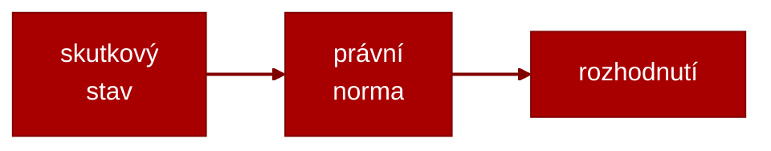

# Cvičení 1 – Právní normy, publikace, aplikace, interpretace, analogie, platnost, účinnost

---

### Základní pojmy:
- Právo

- Dualismus (objektivní x subjektivní, přirozené x pozitivní, veřejné x soukromé, hmotné x procesní)

- Systém práva

___
### Právní norma:
- Právní normy jsou obecně závazná pravidla lidského chování, stanovená nebo uznaná státem (resp. mezinárodním společenstvím států), jejichž porušení stát sankcionuje (resp. státy vytvořené mezinárodní instituce sankcionují).
  
  
### Mody normativnosti:
- Objektivní:
	- příkaz
	- zákaz
	- dovolení
- Subjektivní
	- oprávnění
	- povinnost
### Právní normy:
Charakteristické rysy PN:
- Závaznost

- Formální určitost

- Obecnost

- Vynutitelnost

___

### Struktura PN:
- Právní norma zpravidla bývá pojímána jako soustava tří navazujících složek (částí): ___hypotézy, dispozice a sankce. Uspořádány jsou jako konjunkce dvou podmíněných vět: „Jestliže je splněna hypotéza, vzniká tím závazek nebo oprávnění uvedené v dispozici“ a „jestliže je splněna hypotéza a nebyl splněn závazek v dispozici, pak vzniká sankční oprávnění nebo závazek“.___
- Tradičně se vychází z toho, že struktura právní normy je trichotomická (trojčlenná) a má podobu podmíněné věty (implikace): __jestliže__ je p (hypotéza), __pak__ nastává q (dispozice), __není-li__ q. nastupuje r (__jinak__ r - sankce). Tato logická podoba právní normy vyplývá z jejího charakteru jako pravidla chování.
#### Hypotéza:
- je podmínka, která personálně (vymezením povinné osoby), lokálně (místním vymezením), temporálně (časovým vymezením) a (nebo) modálně omezuje platnost dispozice.
#### Dispozice:
- Dispozice je vyjádření příkazu, zákazu, dovolení nebo práva (nároku). Dispozice zakládá za podmínek určených hypotézou závazkový vztah mezi osobami (stranami), tedy komplementární (vzájemně se doplňující) práva a povinnosti.
- Dispozice nemůže u normy absentovat, jinak by ztratila smysl.
#### Sankce:
- Sankce je vlastně další dispozicí, která se uplatní v případě, že osoba, jíž vyplývá závazek ze základní dispozice, jej nesplní. Sankcí může být například trest, výchovné nebo ochranné opatření, náhradní závazek anebo částečné nebo úplné přenesení původního závazku na jinou osobu.
- Sankce může být uvedena přímo u textu dispozice, k níž se vztahuje, nebo v samostatné části právního předpisu nebo v samostatném právním předpisu. Právní normy, k nimž nelze žádnou (účinnou) sankci přiřadit, se někdy označují jako nedokonalé (lat. lex imperfecta

___
### Klasifikace právních norem:
#### Druhy PN:
- podle způsobu vymezení pravidla chování

	- ___přikazující___ – určují jak se chovat.
	
	- ___zakazující___ – zakazují určitý druh chování
	
	- ___opravňující___ – dovolují určitý druh chování (§ 29, § 436 OZ)
- podle stupně závaznosti
	- ___kogentní___ (kategorické) – jsou formulovány natolik imperativně, že nedávají žádný prostor po vůli adresáta normy. Ten musí přesně ustanovení normy naplnit. Toto je typické pro oblast veřejného a procesního práva (§ 46, § 479 OZ).
	- ___dispozitivní___ – buď vůbec nestanoví pravidlo chování nebo ho stanoví podpůrně, tzn. subjekty práv. vztahu si vlastní dohodou stanovily určili pravidlo chování; pokud si ho nestanovily, nastupuje podpůrné ustanovení příslušné podpůrné právní normy. Toto je typické pro oblast soukromého práva (§ 507, § 545 OZ).
Příklady:
	Je PN kogentní nebo dispozitivní?:
	_§ 16 zákona č. 262/2006 Sb., zákoník práce
	(Rovné zacházení se zaměstnanci, zákaz diskriminace)
	(1)
	„Zaměstnavatelé jsou povinni zajišťovat rovné zacházení se všemi zaměstnanci, pokud jde o jejich pracovní podmínky, odměňování za práci a o poskytování jiných peněžitých plnění a plnění peněžité hodnoty, o odbornou přípravu a o příležitost dosáhnout funkčního nebo jiného postupu v zaměstnání.“
	§ 1963 OZ
	(Splatnost bez výzvy)
	(2)„Smluvní strany si mohou ujednat dobu splatnosti delší šedesáti dnů jen tehdy, pokud to není vůči věřiteli hrubě nespravedlivé. Je-li však obsahem závazku podnikatele povinnost dodat zboží nebo službu veřejnoprávní korporaci, smluvní strany si mohou ujednat delší dobu splatnosti jen tehdy, pokud je to odůvodněno povahou závazku, a doba splatnosti nesmí přesáhnout šedesát dní.“

#### Působnost PN:
___Působností právní normy se rozumí vymezení rozsahu realizace a aplikace právní normy.___
Rozlišují se čtyři roviny působnosti právních norem:
- věcná působnost - 
	- právní normy se týká skutkové charakteristiky případů, které právní norma (jejich souhrn, tedy právní institut) upravuje.
	- normy obecné (s obecnou působností) - „lex generalis" - vztahují se na větší počet stejných případů,
	- normy speciální (se zvláštní působností) - „lex specialis" - upravují odlišně věcně shodnou problematiku

- prostorová působnost -
	- vychází z teritoriální působnosti orgánů veřejné moci, které vydávají či oficiálně uznávají příslušné právní normy.
	- PN s celostátní působností (např. zákon) PN lokální právní normy (např. nařízení rady kraje či obecně závazná vyhláška obce).
	- Významná je i problematika exteritoriality (použití právní normy mimo území státu, jehož právního řáduje součástí).

- osobní působnost -
	- je založena na principu rovnosti před zákonem a spočívá v druhovém vymezení právních subjektů v hypotéze právní normy. Odpovídá na otázku, na které osoby platí právní norma.
	- Součástí problematiky osobní působnosti právních norem je i možnost stanovit imunitu a exempce (a vymezit jejich rozsah) pro určité skupiny právních subjektů.
	  
	  1) absolutní (idemnita)
		  - hlava státu - monarcha či prezident (v ČR není prezident odpovědný ani za přestupky, ani trestně odpovědný za jednání, kterého se dopustí v době funkčního období; může být souzen pouze za velezradu. což je zvláštní druh ústavního deliktu),
		  
		  - diplomatičtí zástupci, diplomat může být vyhoštěn jako persona non grata (osoba nežádoucí, nevítaná),
		  
		 - členové zákonodárného sboru (v ČR poslanci, resp. senátoři; pokud jde o jejich hlasování v Poslanecké sněmovně nebo v Senátu nebo jejich orgánech, nemohou být nijak postiženi).
		 
	2) relativní
		- členové zákonodárného sboru, pokud jde o možnost trestního stíhání, stíhání za přestupek nebo za jejich projevy, bývá v různém rozsahu podmíněna souhlasem příslušného zákonodárného sboru či komory, resp. je omezena možnost postihu pouze na disciplinární odpovědnost,
		- soudci ústavního soudu mají obdobný rozsah imunity a režim trestní popř. přestupkové odpovědnosti jako členové zákonodárného sboru

 - časová působnost - 
	 - souvisí s platnosti a účinností právního předpisu.
	 - ___Platnost:___ nastává dnem publikace ve sbírce zákonů, okamžik, kdy je možné se seznámit s obsahem, ale ještě není nutné se právní normou řídit
	 - ___Účinnost___: nastává dnem uvedeným v posledním ustanovení každé právní normy, pokud není uvedeno, pak  15.dnem po zveřejnění ve Sb.zák.
	 Někdy platnost a účinnost splývá  v jeden den ( účinnost nastává dnem publikace v Sbírce zákonů )

#### Publikace právních norem v ČR:
- Sbírka zákonů - Sb. - vyhlašování zákonem stanovených právních předpisů (zákon č. 309/1999 Sb., o Sbírce zákonů a o Sbírce mezinárodních smluv)
- Sbírka mezinárodních smluv - Sb. m. s. - sdělením MZV se vyhlašují zejm.:
	- platné mezinárodní smlouvy, jimiž je ČR vázána
	- oznámení a výpovědi mezinárodních smluv
	- rozhodnutí přijatá mezinárodními orgány a orgány mezinárodních organizací,  jimiž je ČR vázána
- [Sbírka právních předpisů územních samosprávných celků a některých správních úřadů](https://sbirkapp.gov.cz/vyhledavani)
	- zřízena zákonem č. 35/2021 Sb., účinnost od 1.1.2022 !!!, dříve jen:
		- Věstník kraje
			- vyhlášení obecně závazných vyhlášek kraje a nařízení kraje
		- Úřední deska obecního úřadu
			- nařízení obce, obecně závazné vyhlášky obce

#### Publikace právních norem:
Ve Sbírce zákonů  jsou vyhlašovány:
- ústavní zákony,
- zákony,
- zákonná opatření Senátu,
- nařízení vlády,
- právní předpisy  vydávané ministerstvy, a ostatními ústředními správními  úřady.

___Publikace právních norem – Sbírka zákonů___:
- vydává se v číslovaných částkách – chronologické číslování v  každém roce dle jejich vydání (nelze přečíslovat, jedině  zrušit a nahradit) – v elektronické a písemné podobě
- obsah předpisu uspořádán do číslovaných paragrafů  (členění na odstavce, písmena)
- ___citace___: číslo předpisu, lomítko, rok vydání, Sb., název
	- zákon č. 89/2012 Sb., občanský zákoník
	- § 5 odst. 1 písm. d) zákona č. 252/1997 Sb., o zemědělství
- okamžik vyhlášení – datum rozeslání částky Sbírky zákonů
- novela – právní předpis upravující změnu nebo doplnění  stávajícího právního předpisu předpisem pozdějším (x  novelizace – proces změny nebo doplnění)
- úplné znění – kvůli přehlednosti u často novelizovaného  právního předpisu

#### Aplikace právních norem:
používání  právní  normy  státními  orgány, ale i chování fyzických a právnických osob podle práva

___Postup:___
- zjištění skutkového stavu (bezprostředně, dokazováním)
- zjištění právních norem, podle kterých má být případ  řešen + jejich výklad (časovou, územní a osobní působnost normy a  její soulad s ústavou)
- rozhodnutí ve věci samé - v mezích zákona, hospodárně

___Řešení případů výslovně neupravených:___
- při vydávání zákona není přihlédnuto ke všem případům, které mohou nastat
- státní orgán, který věc posuzuje a rozhoduje o ní (zpravidla tedy soud),  však není oprávněn odmítnout řešení věci
- rozhodování dle analogie:
- ___analogie podle zákona___ – použije se právní norma, která upravuje  případ nejobdobnější
- pro případ, kdy konkrétní vztah není upraven žádnou právní normou
- ___analogie podle  práva___  -  na  základě  obecných  principů  českého právního řádu a podle smyslu celého systému právních pravidel
- pokud neexistuje konkrétní norma, ani právní norma obdobná:
	- vyloučena analogie v trestním právu, finančním a správním; připuštěna v právu občanském, obchodním, rodinném a pracovním

___Interpretace právních norem___:
- výklad právní normy - právní norma je abstraktní pravidlo  chování, při svém uplatňování na konkrétní případ musí být  vykládána, interpretována
- rozlišení podle toho, kdo výklad podává:
	- ___legální___  –  obecně  závazný,  výklad  orgánu  zmocněného  k  tomu  ústavou,  v  ČR  zmocnění není
	- ___oficiální___ - státní orgán pro podřízené orgány či pracovníky; nezavazuje služebně nepodřízené
	- ___Nejvyššího soudu a Vrchního soudu___ – rozhodnutí a stanoviska, není obecně právně  závazný, ovlivňuje soudní praxi
	- ___orgánu aplikujícího právo___ – zpravidla soud, ale také správní orgány  při své  rozhodovací činnosti (např. stavební úřad), právně závazný výlučně jen v konkrétním  posuzovaném případě
	- ___doktrinální___ - založený na vědeckém zkoumání platného práva;  v komentářích,  v učebnicích atd.; není právně závazný, praxi ovlivňuje
- rozlišení dle metody výkladu:
	- metoda jazyková, historická, logická, systematická

___Interpretace práva___:
Výklad práva provádí  soudce,  základní výkladové metody:
- ___Gramatická (jazyková)___ metoda je přímočarý výklad právní normy z jejího textu. Při výkladu se vychází ze struktury věty, rozebírají se vztahy mezi jednotlivými částmi souvětí i jednotlivých vět, co použité výrazy obvykle znamenají apod.

- ___Systematická metoda___ znamená, že se studuje umístění rozebírané právní normy v textu a systému právního předpisu (např. se hodnotí členění předpisu na části, hlavy a oddíly, dovozuje jaký význam mají marginální rubriky atd.) a jaké je postavení zkoumaného právního předpisu v daném [právním odvětví](https://cs.wikipedia.org/wiki/Pr%C3%A1vn%C3%AD_odv%C4%9Btv%C3%AD) a případně i v celém [právním řádu](https://cs.wikipedia.org/wiki/Pr%C3%A1vn%C3%AD_%C5%99%C3%A1d).

- Logická, v této metodě se využívá logických postupů, a to především logického výkladu opaku, silnějšího a sporem.
