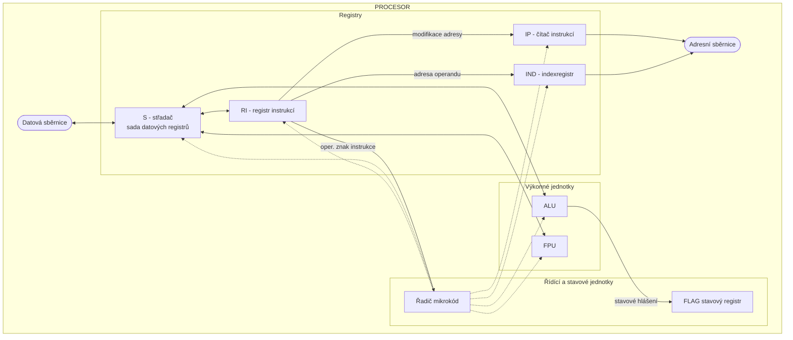

# Kódování celých čísel 

**Celá čísla** (čísla s pevnou řádovou čárkou) zahrnují jak kladná, tak i záporná celá čísla.

---

## Problém se znaménkem

> [!note] Klíčový problém
> Binární čísla v počítači sama o sobě **nemají znaménko** (především `-`). Je proto nutné najít způsob, jak převést celou číselnou osu (včetně záporných čísel) na přirozená (nezáporná) čísla, která lze reprezentovat pomocí bitů.
> 
> 
> *Celá osa čísel (záporná i kladná) se musí "namapovat" na rozsah nezáporných čísel, která počítač umí uložit.*

---

## Velikost úložiště a rozsah hodnot 

Podle předpokládaného rozsahu hodnot se celá čísla ukládají do kódových slov o velikosti **1 až 4 bajty** (B). Velikost úložiště přímo ovlivňuje, jak velká čísla lze reprezentovat.

| Kódové slovo | Rozsah (jen kladná / unsigned) | Rozsah (kladná i záporná / signed) |
| :----------- | :----------------------------- | :--------------------------------- |
| **1 byte** | 0 ÷ 255 | -128 ÷ 127 |
| **2 byte** | 0 ÷ 65 535 | -32 768 ÷ 32 767 |
| **4 byte** | 0 ÷ 4 294 967 295 | -2 147 483 648 ÷ 2 147 483 647 |

> [!info] Všimněte si asymetrie
> U záporných čísel je rozsah vždy o jedno číslo větší "do mínusu" (např. -128 vs +127). To je dáno tím, že nula je považována za kladné číslo, což uvolňuje jednu pozici pro zápornou stranu.

# Doplňkový kód

Pro uložení **celých čísel (X)**, včetně záporných, se v počítačích nejčastěji používá metoda **doplňkového kódu**. Tento způsob efektivně převádí celou číselnou osu na nezáporná čísla, která lze snadno reprezentovat v binární soustavě.

---

## Princip vytvoření doplňkového kódu

> [!abstract] Pravidla pro převod
> Pro původní číslo **X** a délku kódového slova **n** (např. 8 bitů) platí:
>
> 1.  Je-li číslo **X kladné nebo nula**, kódové slovo **X'** je rovno původnímu číslu:
>     $$X' = X$$
> 2.  Je-li číslo **X záporné**, kódové slovo **X'** se vypočítá jako:
>     $$X' = X + 2^n$$
> 3.  Výsledné desítkové číslo **X'** se následně převede do binární soustavy.

---

## Příklad (pro 8bitové slovo, n=8)

V tomto příkladu je $2^n = 2^8 = 256$.

| Původní číslo (X) | Výpočet X' | Kódové slovo X' (desítkově) | Kódové slovo X' (binárně) | Kódové slovo X' (hexadecimálně) |
| :---: | :--- | :---: | :---: | :---: |
| **0** | `X' = 0` | 0 | `0000 0000` | `00` |
| **53** | `X' = 53` | 53 | `0011 0101` | `35` |
| **-53** | `X' = -53 + 256` | 203 | `1100 1011` | `CB` |

> [!info] Klíčová vlastnost
> Tento způsob kódování je velmi výhodný, protože aritmetické operace (zejména sčítání a odčítání) fungují stejně pro kladná i záporná čísla, což výrazně zjednodušuje návrh procesorů.

# Doplňkový kód – Vlastnosti a výpočet

Doplňkový kód má několik klíčových vlastností, které z něj dělají efektivní metodu pro reprezentaci celých čísel v počítačích.

---

## Vlastnosti doplňkového kódu

> [!note] Klíčové vlastnosti
> -   U **nezáporného čísla** (včetně nuly) je hodnota prvního bitu zleva (nejvyššího bitu) **0**.
> -   U **záporného čísla** je hodnota prvního bitu zleva **1**.
> -   Tento formát je navržen tak, aby byl **vhodný pro aritmetické operace**, protože sčítání funguje stejně pro kladná i záporná čísla.

---

## Doplněk – Jak znegovat číslo

Doplněk `d(x)` k číslu `x` je definován jako jeho opačná hodnota (negace). Platí tedy $x + d(x) = 0$, z čehož plyne $d(x) = -x$.

> [!abstract] Postup výpočtu doplňku (dvojkový doplněk)
> Praktický postup pro získání doplňku `d(x)` k číslu `x` má dva kroky:
> 1.  **Inverze bitů (Jedničkový doplněk):** V binárním zápisu čísla `x` zaměníme všechny nuly za jedničky a všechny jedničky za nuly.
> 2.  **Přičtení jedničky:** K výsledku z prvního kroku binárně přičteme `1`.

---

## Příklad výpočtu (pro 8 bitů)

> [!example]
> **Výpočet d(53) = -53:**
> 1.  **Číslo 53:** `0011 0101`
> 2.  **Negace bitů:** `1100 1010`
> 3.  **Přičtení +1:** `1100 1011` (Toto je kód pro -53)
>
> **Kontrola: Výpočet d(-53) = 53:**
> *(vezmeme výsledek pro -53 a znegujeme ho)*
> 4.  **Číslo -53:** `1100 1011`
> 5.  **Negace bitů:** `0011 0100`
> 6.  **Přičtení +1:** `0011 0101` (Toto je kód pro 53)

# Sčítání dvou čísel v doplňkovém kódu

Sčítání v doplňkovém kódu funguje stejně pro kladná i záporná čísla. Základem je standardní binární sčítání bit po bitu, které zahrnuje výpočet přenosu (Carry) do dalšího řádu.

Mějme dvě **n-bitová čísla** A ($a_{n-1} \dots a_0$) a B ($b_{n-1} \dots b_0$) v doplňkovém kódu.

---

## 1. Výpočet binárního přenosu (C)

Nejprve stanovíme řetězec přenosových bitů $C = (c_n \dots c_1, c_0)$ podle následujících rekurzivních pravidel.

> [!abstract] Pravidla pro výpočet přenosu
> -   **Počáteční přenos $c_0$ je vždy 0.**
>
> -   Pro každý bit $i$ (od 0 do n-1) platí:
>     -   Přenos **$c_{i+1} = 1$**, pokud jsou alespoň **dvě** z hodnot ($a_i, b_i, c_i$) rovny 1.
>     -   V opačném případě je přenos **$c_{i+1} = 0$**.

---

## Příklad (4bitový kód, n=4)

> [!example] Sčítání +5 a -4
> -   **A = 5** $\implies$ `0101`
> -   **B = -4** $\implies$ `1100`
>
> **Postup výpočtu přenosu C:**
> -   $c_0 = 0$ (vždy)
> -   **i=0:** ($a_0=1, b_0=0, c_0=0$). Jen jedna '1' $\implies$ $c_1=0$.
> -   **i=1:** ($a_1=0, b_1=0, c_1=0$). Žádná '1' $\implies$ $c_2=0$.
> -   **i=2:** ($a_2=1, b_2=1, c_2=0$). Dvě '1' $\implies$ $c_3=1$.
> -   **i=3:** ($a_3=0, b_3=1, c_3=1$). Dvě '1' $\implies$ $c_4=1$.
>
> **Výsledný řetězec přenosů C ($c_4 c_3 c_2 c_1 c_0$) je `1 1 0 0 0`.**

# Sčítání v doplňkovém kódu: Výsledek a přetečení

Po výpočtu přenosových bitů ($c_i$) můžeme sestavit finální výsledek a ověřit jeho platnost.

---

## 2. Výpočet výsledného součtu (S)

Výsledný binární řetězec $S = (s_{n-1} \dots s_1, s_0)$ získáme tak, že pro každý bit `i` (v rozsahu od 0 do n-1) provedeme operaci **XOR** (exkluzivní součet) mezi odpovídajícími bity sčítanců ($a_i, b_i$) a přenosem z předchozího řádu ($c_i$).

> [!abstract] Vzorec pro výpočet bitů součtu
> $$
> s_i = a_i \oplus b_i \oplus c_i
> $$

---

## 3. Validační kritérium: Detekce přetečení (Overflow)

Ne vždy se výsledek sčítání vejde do daného počtu bitů. Tento stav se nazývá **přetečení (overflow)** a znamená, že výsledné číslo `S` je neplatné. K jeho detekci slouží validační kritérium.

> [!important] Pravidlo pro detekci přetečení
> Přetečení nastane, pokud se přenos **do** posledního (znaménkového) bitu **liší** od přenosu **z** posledního bitu.
>
> Vypočítáme hodnotu `v` porovnáním dvou posledních přenosových bitů:
> $$
> v = c_n \oplus c_{n-1}
> $$
> Kde:
> -   **$c_{n-1}$** je přenos *do* posledního bitu (bitu s indexem n-1).
> -   **$c_n$** je přenos *z* posledního bitu.
>
> **Vyhodnocení:**
> -   Pokud je **$v = 1$**, došlo k **přetečení**. Výsledek `S` je neplatný a není součtem `A + B`.
> -   Pokud je **$v = 0$**, je výsledek `S` **platný** a vyjadřuje správný součet `A + B`.

---

## Příklad (4bitový kód, n=4)

> [!example] Sčítání +5 a -4
> -   **A = 5** $\implies$ `0101`
> -   **B = -4** $\implies$ `1100`
> -   **C (přenosy):** `11000` (viz předchozí slide)
>
> **Výpočet součtu S:**
> -   $s_0 = a_0 \oplus b_0 \oplus c_0 = 1 \oplus 0 \oplus 0 = 1$
> -   $s_1 = a_1 \oplus b_1 \oplus c_1 = 0 \oplus 0 \oplus 0 = 0$
> -   $s_2 = a_2 \oplus b_2 \oplus c_2 = 1 \oplus 1 \oplus 0 = 0$
> -   $s_3 = a_3 \oplus b_3 \oplus c_3 = 0 \oplus 1 \oplus 1 = 0$
> -   **Výsledek S:** `0001` (což je desítkově 1)
>
> **Validace (kontrola přetečení):**
> -   $c_{n-1} = c_3 = 1$ (přenos *do* posledního bitu)
> -   $c_n = c_4 = 1$ (přenos *z* posledního bitu)
> -   $v = c_4 \oplus c_3 = 1 \oplus 1 = 0$
>
> **Závěr:** $v=0$, výsledek je platný. Součet **`0001`** je správný.

# Násobení čísla X k-tou mocninou dvojky

Násobení libovolného čísla **X** k-tou mocninou dvojky ($2^k$) je v binární soustavě velmi efektivní operace. Místo složitého aritmetického výpočtu se provádí jednoduchým **bitovým posunem doleva**.

---

## Princip násobení

> [!abstract] Postup
> 1.  Binární řetězec čísla **X** se posune o **k-míst vlevo**.
> 2.  Na uvolněná místa zprava se vždy doplní hodnota **0**.

Výsledkem je číslo **S**, které odpovídá součinu $S = X \cdot 2^k$.

---

## Příklad (pro k=2)

> [!example]
> Chceme vynásobit číslo **X** číslem 4, což je $2^2$. Budeme tedy posouvat o **k=2** místa doleva.
>
> **Původní číslo X:**
> `... xₙ₋₂  xₙ₋₃  ...  x₂  x₁  x₀`
>
> **Výsledné číslo S (posunuto o 2 místa doleva):**
> `... xₙ₋₂  xₙ₋₃  ...  x₂  x₁  x₀  0  0`
>
> Původní bity se posunuly a zprava se doplnily dvě nuly.

> [!info] Proč to funguje?
> V binární soustavě (stejně jako v desítkové) má každá pozice čísla svou váhu. Posunem o jednu pozici doleva se váha každého bitu zdvojnásobí, což odpovídá násobení dvěma. Když tento posun provedeme *k*-krát, výsledek je stejný jako násobení číslem $2^k$.

![[Pasted image 20251019135316.png]]

# Dělení čísla X k-tou mocninou dvojky

Podobně jako násobení, i dělení čísla **X** k-tou mocninou dvojky ($2^k$) lze v binární soustavě provést velmi efektivně pomocí **bitového posunu doprava**. Tento typ posunu se nazývá **aritmetický posun**.

---

## Princip dělení

> [!abstract] Postup
> 1.  Binární řetězec čísla **X** se posune o **k-míst vpravo**.
> 2.  Na uvolněná místa zleva se nedoplňují nuly, ale **stejná hodnota, jakou měl původní nejvyšší (znaménkový) bit $x_{n-1}$**. Tím je zajištěno zachování znaménka i u záporných čísel.
>
> Výsledkem operace jsou dvě části:
> -   Výsledek celočíselného dělení (**div**)
> -   Zbytek po celočíselném dělení (**mod**)

---

## Příklad (pro k=2)

> [!example] Dělení číslem 4 ($D = X \text{ div } 2^2, M = X \text{ mod } 2^2$)
> Chceme vydělit číslo **X** číslem 4, tedy posouváme o **k=2** místa doprava.
>
> **Původní číslo X:**
> `xₙ₋₁  xₙ₋₂  ...  x₂  x₁  x₀`
>
> **Po posunutí o 2 místa doprava:**
>
> | Původní bity | `xₙ₋₁` | `xₙ₋₂` | `...` | `x₂` | `x₁` | `x₀` |
> | :--- | :--- | :--- | :--- | :--- | :--- | :--- |
> | **Výsledný podíl D** | `xₙ₋₁` | `xₙ₋₁` | `...` | `xₙ₋₂` | `...` | `d₀` |
> | **Výsledný zbytek M**| | | | | `m₁` | `m₀` |
>
> Zleva se doplnila hodnota původního znaménkového bitu $x_{n-1}$. Bity, které zůstaly (`d...`), tvoří podíl **D**. Bity $x_1$ a $x_0$, které byly vysunuty, tvoří zbytek **M**.

> [!warning] Důležité pro záporná čísla
> V doplňkovém kódu tento postup správně stanoví výsledek **celočíselného dělení (div)** a **zbytku po dělení (mod)**, což je klíčové pro správné fungování aritmetiky se zápornými čísly.

![[Pasted image 20251019135429.png]]

# Čísla v pohyblivé řádové čárce

Pro reprezentaci **reálných čísel** se v počítačích nejčastěji používá standardizovaný **formát IEEE 754**. Základní (32bitová, tzv. single-precision) varianta definuje, jak je reálné číslo `x` uloženo do 32bitového kódového slova `x'`.

> [!abstract] Obecný tvar čísla
> Každé reálné číslo je převedeno do semilogaritmického tvaru (normalizováno):
> $$
> x = \pm 1,m \cdot 2^e
> $$
> Kde:
> - **±** je znaménko.
> - **1,m** je mantisa (normalizovaná tak, aby byla vždy v intervalu `[1, 2)`).
> - **e** je exponent.

---

## Struktura 32bitového kódového slova

32bitové slovo je rozděleno do tří logických částí, z nichž každá kóduje jednu složku výše uvedeného tvaru.

### 1. Znaménko (±)
> [!note]
> - **Bit:** 31 (jeden nejvyšší bit).
> - **Význam:**
>    - **0** = nezáporné číslo (+).
>    - **1** = záporné číslo (-).

### 2. Exponent (e)
> [!info]
> - **Bity:** 30 až 23 (celkem 8 bitů).
> - **Rozsah:** Umožňuje reprezentovat exponent `e` z intervalu `(-126; 127)`.
> - **Kódování:** Do paměti se neukládá přímo exponent `e`, ale jeho posunutá hodnota `e'` (tzv. kód s posunutou nulou neboli *bias*). Pro 8 bitů je posun (bias) 127.
> - **Výpočet:**
>   $$
>   e' = e + 2^{8-1} - 1 = e + 127
>   $$

### 3. Mantisa (m)
> [!note]
> - **Bity:** 22 až 0 (celkem 23 bitů).
> - **Význam:** Reprezentuje desetinnou (zlomkovou) část čísla.
> - **Princip:** Protože je číslo vždy normalizováno do tvaru `1,m...`, je úvodní jednička **implicitní** (tzv. *hidden bit*) a do paměti se neukládá. Ukládá se pouze část za desetinnou čárkou, označená jako `m' = a₂₂...a₀`.
> - **Výpočet hodnoty:** Hodnota mantisy `m` se z uložených bitů `m'` vypočítá jako:
>   $$
>   m = \sum_{i=1}^{23} a_{23-i} \cdot 2^{-i}
>   $$

---

### Rozložení bitů

| Bit        | 31                   | 30                       | ... | 23  | 22                       | ... | 0   |
| :--------- | :------------------- | :----------------------- | :-- | :-- | :----------------------- | :-- | :-- |
| **Význam** | **Znaménko** (1 bit) | **Exponent e'** (8 bitů) |     |     | **Mantisa m'** (23 bitů) |     |     |
![[Pasted image 20251019135602.png]]

# IEEE 754 formát čísla - Vlastnosti

Kromě běžných reálných čísel definuje standard IEEE 754 také několik **speciálních hodnot**. Tyto hodnoty jsou reprezentovány specifickými kombinacemi bitů ve znaménku, exponentu a mantise.

---

## Speciální hodnoty

> [!note] Nula (kladná a záporná)
> - **Reprezentace:** Exponent `e` je nulový (samé nuly) a mantisa `m` je také nulová (samé nuly).
> - **Znaménkový bit (±):** Rozlišuje mezi **+0** a **-0**.
> - **Formát:** $\pm 0,m \cdot 2^e$

> [!note] Nekonečno (±)
> - **Reprezentace:** Exponent `e` je maximální (binárně samé jedničky) a mantisa `m` je nulová (samé nuly).
> - **Znaménkový bit (±):** Rozlišuje mezi kladným a záporným nekonečnem.
> - **Vzniká:** Například při dělení nenulového čísla nulou.

> [!note] Nedefinovaná hodnota (Not a Number, NaN)
> - **Reprezentace:** Exponent `e` je maximální (binárně samé jedničky) a mantisa `m` je **libovolná nenulová** hodnota.
> - **Vzniká:** Při neplatných operacích, jako je $\sqrt{-1}$ (odmocnina ze záporného čísla) nebo $0/0$.

> [!note] Velmi malá čísla blízko nule (Denormalizovaná čísla)
> - **Reprezentace:** Exponent `e` je nulový (binárně samé nuly) a mantisa `m` je **libovolná nenulová** hodnota.
> - **Formát:** $\pm 0,m \cdot 2^e$
> - **Význam:** Umožňují reprezentovat čísla, která jsou menší než nejmenší normalizované číslo, a zajišťují tak plynulejší přechod k nule.

# IEEE 754 formát čísla - Varianty přesnosti

Standard IEEE 754 definuje několik variant formátů, které se liší svou **přesností** a celkovou délkou kódového slova. Volba formátu ovlivňuje rozsah hodnot a přesnost, s jakou lze reálné číslo reprezentovat.

---

## Srovnávací tabulka variant

Následující tabulka shrnuje klíčové parametry pro nejběžnější binární formáty definované standardem IEEE 754-2008.

| Formát (IEEE 754-2008) | binary16 | binary32 | binary64 | binary128 |
| :--- | :---: | :---: | :---: | :---: |
| **Běžné značení** | (half) | **single** | **double** | (quad) |
| **Šířka kód. slova (bit)** | **16** | **32** | **64** | **128** |
| - Znaménko (bit) | 1 | 1 | 1 | 1 |
| - Šířka exponentu (bit) | 5 | 8 | 11 | 15 |
| - Šířka mantisy (bit) | 10 | 23 | 52 | 112 |
| **Max. exponent (±)** | **15** | **127** | **1 023** | **16 383** |

---

> [!info] Vysvětlivky k tabulce
> - **Běžné značení:** Formáty `binary32` a `binary64` jsou v programovacích jazycích téměř výhradně označovány jako `single` (pro 32bitovou přesnost) a `double` (pro 64bitovou přesnost).
> - **Šířka mantisy:** Uvedený počet bitů (např. 23 pro `single`) odpovídá fyzicky uložené části mantisy (`m'`). Celková přesnost čísla je o 1 bit vyšší díky implicitnímu (skrytému) bitu `1` v normalizovaném tvaru.
> - **Max. exponent (±):** Toto číslo udává maximální hodnotu exponentu `e` a je také použito pro výpočet posunu (bias) jako $bias = 2^{k-1}-1$, kde `k` je šířka exponentu. Například pro `single` je $bias = 2^{8-1}-1 = 127$.

# Koncepce konstrukce počítače

Historicky se vyvinuly dva základní modely (architektury), jak jsou počítače konstruovány. Liší se především tím, jak přistupují k paměti, ve které jsou uloženy instrukce (program) a data.

Tato koncepce byla poprvé publikována Johnem von Neumannem v roce 1945 v článku "First Draft of a Report on the EDVAC".

---

## Základní komponenty (dle diagramu)

-   **Procesor:** "Mozek" počítače, skládá se ze dvou hlavních částí:
    -   **ALU a registry (Aritmeticko-logická jednotka):** Provádí veškeré výpočty a operace.
    -   **Řadič:** Řídí a koordinuje činnost všech ostatních částí počítače pomocí řídících signálů.
-   **Operační paměť:** Ukládá programy a data, se kterými procesor aktivně pracuje.
-   **Vstupní zařízení:** Slouží pro vkládání dat a instrukcí do počítače (např. klávesnice).
-   **Výstupní zařízení:** Slouží pro zobrazení výsledků (např. monitor).
![[Pasted image 20251019135856.png]]
---

## Dvě hlavní architektury

### 1. John von Neumannovo schéma počítače

> [!note] Hlavní rys
> Používá **jednu společnou elektronickou paměť** jak pro **program** (instrukce), tak pro **data**.
>
> **Důsledek:** Procesor nemůže číst instrukci a data ve stejném okamžiku, protože k nim přistupuje přes stejnou sběrnici (cesta k paměti). Toto je dnes nejběžnější architektura u osobních počítačů.

### 2. Harwardské schéma počítače

> [!note] Hlavní rys
> Používá **oddělenou paměť** zvlášť pro **data** a zvlášť pro **program**.
>
> **Důsledek:** Procesor může číst instrukci z paměti programu a zároveň pracovat s daty v paměti dat, což může vést k vyššímu výkonu. Tato architektura se dnes často používá ve specializovaných procesorech (např. signálové procesory, mikrokontroléry).

# Princip činnosti počítače Von Neumannova typu

Architektura počítače typu Von Neumann je založena na myšlence společné paměti pro instrukce i data. Cyklus zpracování instrukcí probíhá v několika základních krocích.

---

> [!abstract] Kroky zpracování
> 1.  **Načtení programu:** Do **operační paměti** se pomocí **vstupních zařízení** (např. klávesnice, disk) umístí **program** (posloupnost instrukcí), který bude prováděn.
>
> 2.  **Načtení dat:** Stejným způsobem se do **operační paměti** umístí **data**, která bude program zpracovávat.
>
> 3.  **Vlastní výpočet:** Proběhne zpracování instrukcí.
>     -   Jednotlivé kroky (aritmetické a logické operace) provádí **ALU** (aritmeticko-logická jednotka).
>     -   Celý proces je koordinován a řízen **řadičem** počítače, který řídí ALU, paměť i vstupně-výstupní moduly.
>     -   Mezivýsledky výpočtu jsou dočasně ukládány do rychlých **registrů** procesoru nebo zpět do **operační paměti**.
>
> 4.  **Výstup výsledků:** Po skončení výpočtu jsou finální **výsledky** poslány na **výstupní zařízení** (např. monitor, tiskárna).

# Procesor a jeho registry

Registry jsou malé, velmi rychlé paměťové jednotky umístěné přímo v procesoru. Slouží k dočasnému ukládání instrukcí, adres, dat a stavových informací, se kterými procesor bezprostředně pracuje.

---

## Základní registry procesoru

Podle slidu a diagramu můžeme identifikovat několik klíčových registrů:

> [!note] Seznam registrů
> -   **Čítač instrukcí (IP - Instruction Pointer):**
>     -   Obsahuje **adresu** v paměti, na které se nachází **následující instrukce**, jež má být provedena. Po načtení instrukce se jeho hodnota aktualizuje, aby ukazoval na další instrukci v pořadí.
>
> -   **Registr instrukcí (RI):**
>     -   Obsahuje kód **právě prováděné instrukce**, která byla načtena z paměti (z adresy, na kterou ukazoval IP). Řadič tuto instrukci dekóduje a provede.
>
> -   **Stavové slovo procesoru (FLAG Register):**
>     -   Nazývá se také registr příznaků. Jednotlivé bity tohoto registru se automaticky nastavují (na 0 nebo 1) podle **výsledku poslední provedené operace** v ALU (např. zda byl výsledek nula, zda došlo k přetečení, zda byl výsledek záporný atd.).
>
> -   **Střadač (S):**
>     -   Často označován také jako Akumulátor. Jedná se o sadu datových registrů, které slouží k ukládání operandů a **výsledků provedených instrukcí**.
>
> -   **Indexregistr (IND):**
>     -   Slouží pro **modifikaci adresy**. Jeho hodnota se přičítá k adrese operandu, což umožňuje efektivně pracovat s poli dat a jinými datovými strukturami.

---

## Další komponenty na diagramu

-   **Řadič (mikrokód):** "Mozek" procesoru; dekóduje instrukce z registru RI a pomocí řídících signálů koordinuje činnost všech ostatních částí (ALU, registrů, sběrnic).
-   **ALU (Aritmeticko-logická jednotka):** Provádí vlastní výpočty (sčítání, odčítání, logické operace).
-   **FPU (Floating Point Unit):** Specializovaná jednotka pro výpočty v pohyblivé řádové čárce (s reálnými čísly).
-   **Sběrnice:** Komunikační cesty:
    -   **Datová sběrnice:** Přenáší data mezi registry, ALU a pamětí.
    -   **Adresní sběrnice:** Přenáší adresy do paměti nebo V/V zařízení.
    -   **Řídící sběrnice:** Přenáší řídící signály z řadiče.

# Programové vybavení počítače (Software)

Programové vybavení (software) se skládá z jednotlivých **programů**.

> [!note] Co je program?
> -   Každý **program** je tvořen **posloupností instrukcí** nižšího či vyššího programovacího jazyka, nebo přímo instrukcí procesoru (strojového kódu).
> -   **Instrukce** určuje, co se má se zpracovávanými informacemi v daný okamžik udělat.

---

## Rozdělení programového vybavení

Programové vybavení je možné dále rozdělit do tří hlavních skupin:

> [!info] 1. Systémový software
> Programové vybavení na úrovni **operačního systému** a **programovacích jazyků**. Zajišťuje základní chod počítače a poskytuje prostředí pro ostatní programy.

> [!info] 2. Aplikační software
> Programové vybavení na úrovni **obecných funkčních a aplikačních programů**. Jsou to programy, se kterými uživatel přímo pracuje (např. textový editor, webový prohlížeč, hry).

> [!info] 3. Firmware
> Programové vybavení, které tvoří neoddělitelnou **součást technického vybavení (hardwaru)**. Toto programové vybavení až na naprosté výjimky **nemůže být uživatelem modifikováno**. (Např. software v BIOSu/UEFI základní desky).

# Strojový kód (Machine code)

---

> [!abstract] Definice strojového kódu
> **Strojový kód** je program vyjádřený v počítači jako **posloupnost instrukcí procesoru**. Jedná se o základní formu programu, reprezentovanou jako posloupnost bajtů, respektive bitů.
> 
> -   Z hlediska **uživatele** je strojový kód nesrozumitelný.
> -   Z hlediska **systému** (procesoru) je přímo proveditelný.
> -   Jazyk symbolických instrukcí – **assembler** – je lidsky čitelnější vrstva, která se překládá přímo do strojového kódu.

---

> [!info] Strojový kód procesoru
> **Strojový kód procesoru** je tedy **množina všech strojových instrukcí**, které je daný typ procesoru schopen rozpoznat a vykonat.

---

> [!warning] Závislost na procesoru
> Kódování instrukcí (jejich binární podoba) je **specifické a závisí na typu procesoru** (např. x86, ARM, RISC-V). Program ve strojovém kódu pro jeden typ procesoru není spustitelný na jiném.

# Instrukce počítače

---

## Formát strojové instrukce

Každá strojová instrukce, kterou procesor vykonává, je kódována jako binární slovo. Formát tohoto slova určuje, z jakých částí se instrukce skládá a co znamenají.

> [!abstract] Základní části strojové instrukce
> Typická strojová instrukce obsahuje několik klíčových polí:
> 
> 1.  **Operační kód (Opcode)**
>     -   Určuje, **jaká operace se bude vykonávat** (např. sčítání, ukládání do paměti, skok). Jak ukazuje diagram, část operačního kódu (operační znak) vybírá konkrétní funkci, kterou provede ALU.
> 
> 2.  **Adresa vstupního operandu (operandů)**
>     -   Identifikuje **data (operandy)**, se kterými bude instrukce pracovat. Může to být přímá hodnota, adresa v paměti nebo adresa registru (zdrojový operand).
> 
> 3.  **Adresa výstupního operandu**
>     -   Stanoví **adresu (místo)**, kam bude po provedení instrukce uložen její výsledek (cílový operand).
> 
> 4.  **Adresa následující instrukce**
>     -   Sdělí procesoru, jakou instrukci má vykonat jako následující (používá se pro skoky a větvení).
>     -   **Pokud tato adresa není v instrukci uvedena**, procesor automaticky přejde k vykonání **bezprostředně následující instrukce** v paměti (pomocí registru IP - Instruction Pointer).

---

> [!info] Zjednodušené formáty instrukcí
> Jak ukazují pruhy na spodní části slidu, formáty se mohou lišit:
> 
> -   **Formát 1 (Datová operace):**
>     `operační kód | vstupní operand(y) | výstupní operand(y)`
> 
> -   **Formát 2 (Řídící operace - skok):**
>     `operační kód | vstupní operand(y) | adresa následující instrukce`

# Činnost procesoru při provádění programu

Aby mohl procesor vykonat jakýkoliv program, musí být tento program nejprve převeden do **strojového kódu** – tedy do sekvence strojových instrukcí, kterým procesor rozumí.

---

## Průběh zpracování

> [!abstract] Sekvenční zpracování
> Po spuštění programu začne procesor **postupně zpracovávat** jednotlivé instrukce jednu po druhé.
> 
> -   Adresa instrukce v paměti, která má být právě zpracována, je uložena ve speciálním registru nazvaném **čítač instrukcí (IP - Instruction Pointer)**.

---

## Fáze zpracování instrukce

Každá jednotlivá instrukce je procesorem zpracována ve dvou základních fázích, které se neustále opakují:

> [!note] 1. Výběrová fáze (Fetch)
> V této fázi procesor načte instrukci z paměti (z adresy uložené v IP) do registru instrukcí (RI).

> [!note] 2. Prováděcí fáze (Execute)
> V této fázi řadič dekóduje načtenou instrukci a provede požadovanou operaci (např. sečte dvě čísla, uloží data do paměti atd.).

# Fáze zpracování instrukcí

Každá instrukce, kterou procesor vykonává, prochází dvěma základními fázemi: výběrovou a prováděcí.

---

## 1. Výběrová fáze (Fetch)

Cílem této fáze je načíst instrukci z operační paměti do procesoru.

> [!abstract] Kroky výběrové fáze
> 1.  Řadič přenese **obsah čítače instrukcí (IP)** (který obsahuje adresu instrukce) na **adresní sběrnici** a vydá příkaz ke čtení z hlavní paměti (HP).
> 2.  Paměť odpoví tím, že přenese **obsah adresované buňky** (samotnou instrukci) na **datovou sběrnici**.
> 3.  Řadič uloží tuto instrukci z datové sběrnice do **registru instrukcí (RI)**.
> 4.  **Obsah čítače instrukcí (IP) se zvýší o 1**, aby ukazoval na bezprostředně následující instrukci pro příští cyklus.

---

## 2. Prováděcí fáze (Execute)

Cílem této fáze je dekódovat načtenou instrukci a vykonat požadovanou operaci.

> [!abstract] Kroky prováděcí fáze
> 1.  Instrukce uložená v registru RI je řadičem **dekódována** (procesor zjistí, co má dělat).
> 2.  Je-li v instrukci nastaven příznak **modifikace indexregistrem (IND)**, je k adrese operandu přičten obsah tohoto indexregistru (to slouží např. pro práci s poli).
> 3.  Řadič naadresuje hlavní paměť (HP) a **přečte obsah vstupních operandů** (dat, se kterými se má počítat).
> 4.  V součinnosti s ALU je instrukce **provedena** (např. proběhne sčítání) a výsledek je uložen do **střadače** (akumulátoru).
> 5.  Řadič zajistí **přenos výsledku** ze střadače na adresu **výstupního operandu** (uloží výsledek tam, kam patří, např. zpět do paměti).

# Vstupní a výstupní operandy

---

## Umístění operandů

Vstupní a výstupní operand (data, se kterými instrukce pracuje) může být fyzicky umístěn na dvou hlavních místech:

> [!note]
> -   **V hlavní paměti (RAM):**
>     -   V tomto případě je operand jednoznačně určen svou **adresou** v paměti.
> -   **V registru procesoru:**
>     -   Procesor má vlastní malá, rychlá paměťová místa (registry), do kterých lze ukládat data pro okamžité použití.

---

## Způsob adresace operandu

> [!abstract] Definice
> **Způsob adresace operandu** definuje, jakým způsobem procesor na základě informací v instrukci identifikuje (najde) operand, se kterým má pracovat.

---

## Dále použité symboly

> [!info] Legenda
> -   **X**: Označuje operand.
> -   **S**: Označuje střadač (akumulátor, speciální registr pro výsledky operací).
> -   **< ... >**: Značí obsah operandu, adresy nebo registru.

# Fáze zpracování instrukcí

Každá instrukce, kterou procesor vykonává, prochází dvěma základními, opakujícími se fázemi: výběrovou a prováděcí.

---

## 1. Výběrová fáze (Fetch)

Cílem této fáze je načíst instrukci z operační paměti do procesoru.

> [!abstract] Kroky výběrové fáze
> 1.  **Řadič přenese obsah čítače instrukcí (IP)** (který obsahuje adresu instrukce) na adresní sběrnici.
> 2.  Řadič vydá příkaz ke čtení z hlavní paměti (HP).
> 3.  Paměť přenese **obsah adresované buňky** (tedy samotnou instrukci) na datovou sběrnici.
> 4.  Řadič uloží tuto instrukci do **registru instrukcí (RI)**.
> 5.  **Obsah čítače instrukcí (IP) se zvýší o 1**, aby ukazoval na bezprostředně následující instrukci pro příští cyklus.

---

## 2. Prováděcí fáze (Execute)

Cílem této fáze je dekódovat načtenou instrukci a provést ji.

> [!abstract] Kroky prováděcí fáze
> 1.  Instrukce uložená v registru instrukcí (RI) je **řadičem dekódována** (procesor zjišťuje, co má dělat).
> 2.  Pokud je v instrukci nastaven příznak **modifikace indexregistrem (IND)**, je k adrese operandu přičten obsah tohoto indexregistru (to slouží k adresování polí).
> 3.  Řadič naadresuje hlavní paměť (HP) a **přečte obsah vstupních operandů** (dat, se kterými se má pracovat).
> 4.  Ve spolupráci s **ALU** (aritmeticko-logickou jednotkou) je **instrukce provedena** (např. proběhne sčítání) a výsledek je uložen do **střadače** (akumulátoru).
> 5.  Řadič zajistí **přenos výsledku** ze střadače na adresu **výstupního operandu** (např. uložení výsledku zpět do paměti).

# Vstupní a výstupní operandy

---

## Umístění operandů

Vstupní a výstupní operand (data, se kterými instrukce pracuje nebo která produkuje) může být umístěn na dvou základních místech:

> [!note] 1. V hlavní paměti
> -   Operand je jednoznačně určen svou **adresou** v paměti.

> [!note] 2. V registru procesoru
> -   Procesor má vlastní interní registry (rychlá paměťová místa), do kterých lze ukládat data a pracovat s nimi mnohem rychleji než s hlavní pamětí.

---

## Způsob adresace operandu

> [!abstract] Definice
> **Způsob adresace operandu** definuje, jakým způsobem bude operand instrukce na základě obsahu procesorem identifikován. Určuje, jak procesor "pochopí", kde má hledat data, která potřebuje ke zpracování instrukce.

---

## Dále použité symboly

Pro následující vysvětlení budou použity tyto symboly:

-   **X**: Označuje operand.
-   **S**: Označuje střadač (akumulátor, speciální registr procesoru).
-   **<... >**: Označuje obsah daného operandu, adresy nebo registru.

# Způsoby adresace operandu

Způsob adresace určuje, jak procesor interpretuje pole operandu v instrukci – zda je to přímo hodnota, se kterou má pracovat, nebo adresa, na které se tato hodnota nachází.

---

## 1. Bezprostřední adresace (Immediate)

> [!abstract] Princip: $X \to S$
> -   Pracuje se **přímo s hodnotou operandu X**, která je součástí instrukce.
> -   Operand je procesoru k dispozici **okamžitě po načtení instrukce**.
> -   Není třeba žádného dalšího čtení z paměti nebo registru.

> [!example] Příklad
> -   Instrukce obsahuje `X = 100`.
> -   Do střadače (S) se uloží přímo hodnota **100**.

---

## 2. Přímá adresace (Direct)

> [!abstract] Princip: $<X> \to S$
> -   Pracuje se s **obsahem paměti na adrese X**.
> -   Hodnota v poli operandu (X) je interpretována jako **adresa hlavní paměti**, na které je teprve uložen skutečný operand (data).

> [!example] Příklad
> -   Instrukce obsahuje `X = 100`.
> -   Procesor se podívá na adresu 100 v paměti.
> -   Podle tabulky je na adrese 100 uložena hodnota 102.
> -   Do střadače (S) se uloží obsah adresy 100, tj. hodnota **102**.
>
> | adresa | obsah |
> | :--- | :--- |
> | 100 | 102 |
> | 101 | 40 |
> | 102 | 101 |

# Způsoby adresace operandu (pokračování)

---

## 3. Nepřímá adresace (Indirect)

> [!abstract] Princip: $<<X>> \to S$
> -   Pracuje se s **obsahem obsahu adresy X** v paměti.
> -   Hodnota v poli operandu (X) je interpretována jako adresa hlavní paměti. Na této adrese ale není uložen operand (data), nýbrž **další adresa**. Teprve na této druhé adrese je uložen skutečný operand.
> -   Tento způsob vyžaduje dvě čtení z paměti.

> [!example] Příklad
> -   Instrukce obsahuje `X = 100`.
> -   Procesor se podívá na adresu 100 a najde tam hodnotu 102.
> -   Procesor interpretuje 102 jako novou adresu, podívá se na adresu 102 a najde tam hodnotu 101.
> -   Do střadače (S) se uloží obsah adresy 102, tj. hodnota **101**.
>
> | adresa | obsah |
> | :--- | :--- |
> | 100 | 102 |
> | 101 | 40 |
> | 102 | 101 |

---

## 4. Adresace s posuvem (Offset)

> [!abstract] Princip: $<X + <R>> \to S$
> -   K adrese `X` (která je součástí instrukce) se přičte obsah nějakého registru `R`.
> -   Pracuje se s **obsahem výsledné adresy** $(X + <R>)$.

> [!info] Typy adresace s posuvem
> Adresaci s posuvem lze použít několika různými způsoby:
> -   **Relativní adresace:**
>     -   `R` = Čítač instrukcí (IP), `X` = posuv (může být i záporný). Používá se pro skoky relativně k aktuální instrukci.
> -   **Bázová (segmentová) adresace:**
>     -   `R` = Základní adresa v HP (báze, segment), `X` = kladný posuv.
> -   **Indexová adresace:**
>     -   `X` = Určitá adresa v HP (začátek pole), `R` = kladný posuv v indexregistru (IND).

> [!example] Příklad (Indexová adresace)
> -   Instrukce obsahuje `X = 100` a odkazuje na indexregistr `IND`, ve kterém je hodnota `1`.
> -   Vypočítá se výsledná adresa: $100 + <IND> = 100 + 1 = 101$.
> -   Procesor přečte obsah adresy 101.
> -   Do střadače (S) se uloží hodnota **40**.

# Typy strojových instrukcí

Strojové instrukce, které procesor vykonává, lze rozdělit do několika základních skupin podle typu operace, kterou provádějí.

---

## 1. Aritmetické a logické instrukce

> [!note]
> Tyto instrukce provádějí výpočty a logické operace s daty, typicky v aritmeticko-logické jednotce (ALU).

Patří sem:
-   **Aritmetické operace:** Základní výpočty jako sčítání, odčítání, násobení, dělení.
-   **Logické operace:** Bitové operace jako logický součet (OR), součin (AND), negace (NON) nebo nonekvivalence (XOR).
-   **Posuvy a rotace:** Instrukce, které posouvají nebo rotují bity v registrech (např. pro rychlé násobení/dělení dvěma).

---

## 2. Instrukce pro přenos dat

> [!note]
> Tyto instrukce samy o sobě nic nepočítají, ale zajišťují **přesun dat mezi různými místy** v počítači (mezi pamětí, registry a V/V zařízeními).

Patří sem:
-   **Čtení z paměti (Load):** Přenos dat z operační paměti do registru procesoru.
-   **Zápis do paměti (Store):** Uložení dat z registru procesoru do operační paměti.
-   **Přesun mezi registry (Move):** Přenos dat z jednoho registru do druhého.
-   **Vstupní a výstupní operace (I/O):** Čtení dat ze vstupního zařízení (např. klávesnice) nebo zápis dat na výstupní zařízení (např. monitor).

# Typy strojových instrukcí (pokračování)

---

## 3. Řídící instrukce

> [!note]
> Tyto instrukce nepracují s daty, ale **ovlivňují tok programu** (pořadí, v jakém se budou instrukce provádět). Umožňují programu větvit se a vytvářet cykly.

Patří sem:
-   **Nepodmíněné skoky:**
    -   Okamžitě a vždy přenášejí řízení programu na jinou, pevně danou adresu v paměti.
-   **Podmíněné skoky:**
    -   Přenášejí řízení (skočí na jinou adresu) jen v případě, že je splněna určitá podmínka.
    -   Podmínka se typicky ověřuje pomocí stavového registru (FLAG), např. zda byl výsledek poslední operace nulový nebo záporný.
-   **Volání podprogramu (Call):**
    -   Nejprve uloží aktuální adresu (adresu návratu) na speciální místo (zásobník) a poté skočí na začátek podprogramu.
-   **Návrat z podprogramu (Return):**
    -   Načte dříve uloženou adresu návratu ze zásobníku a skočí zpět na tuto adresu v hlavním programu.
-   **Instrukce HALT (Zastavení):**
    -   Okamžitě zastaví vykonávání programu a procesor přejde do klidového stavu.

# Logické instrukce

---

> [!note] Manipulace s bity
> Většina procesorů poskytuje řadu instrukcí pro **logické manipulace s bity operandů**. Tyto instrukce se dělí na dvě hlavní skupiny:
> -   **Logické instrukce** (bitové operace)
> -   **Instrukce posuvu a rotace**

---

> [!abstract] Přehled logických operací
> Logické instrukce obvykle realizují následující základní logické operace:
>
> -   **AND** (logický součin, konjunkce)
>     -   značí se: $\wedge$, $\cdot$, &
>
> -   **OR** (logický součet, disjunkce)
>     -   značí se: $\vee$, $+$, |
>
> -   **EQ** (ekvivalence, stejnost)
>     -   značí se: $\leftrightarrow$, $\Leftrightarrow$
>
> -   **XOR** (nestejnost, výlučné nebo)
>     -   značí se: $\oplus$
>
> -   **NON** (negace)
>     -   značí se: $\neg$, ', $\bar{}$ (nadtržítko)

# Vykonání logické instrukce

Mějme dva **n-bitové** operandy **A** ($a_{n-1}, a_{n-2}, \dots a_0$) a **B** ($b_{n-1}, b_{n-2}, \dots b_0$).

---

> [!abstract] Princip vykonání instrukce
> Vykonání logické instrukce (operace) ve tvaru **`OP A, B`** znamená:
>
> 1.  Provedení příslušné logické operace (OP) na **všech souhlasných bitech** obsahu operandů A a B.
> 2.  Uložení výsledku operace zpět do v pořadí **druhého operandu**, tj. do operandu **B**.
>
> ---
>
> -   **Symbolický význam instrukce:**
>     `B = <A> OP <B>`
>
> -   **Pro všechny bity `i` operandů A a B tedy platí:**
>     $b_i = a_i \text{ OP } b_i$ (kde $a_i, b_i \in \{0,1\}$)

---

> [!example] Příklad: AND A, B
> -   Předpokládejme `A = 1100` a `B = 1010`.
> -   Instrukce `AND A, B` provede operaci AND na jednotlivých bitech.
> -   `1 AND 1 = 1`
> -   `1 AND 0 = 0`
> -   `0 AND 1 = 0`
> -   `0 AND 0 = 0`
> -   Výsledek je `1000`.
> -   Tento výsledek se uloží zpět do operandu B.
> -   **Výsledek:** `A = 1100`, `B = 1000`.

# Logické instrukce – obecná pravidla

---

## Přehled logických operací (instrukcí)

Následující tabulka shrnuje základní algebraická pravidla pro bitové logické operace. Tato pravidla jsou užitečná pro manipulaci s bity, například pro maskování nebo testování bitů.

> [!abstract] Pravidla pro bitové operace
> | AND | OR | XOR |
> | :--- | :--- | :--- |
> | $a_i \wedge 0 = 0$ | $a_i \vee 0 = a_i$ | $a_i \oplus 0 = a_i$ |
> | $a_i \wedge 1 = a_i$ | $a_i \vee 1 = 1$ | $a_i \oplus 1 = \neg a_i$ |
> | $a_i \wedge a_i = a_i$ | $a_i \vee a_i = a_i$ | $a_i \oplus a_i = 0$ |

---

## Příklad logických instrukcí

> [!example] Příklad bitových operací
> Pro zpracování každé instrukce se berou vždy výchozí hodnoty operandů A a B. Výsledek operace je uložen do operandu B.
>
> | Operace | Bit 7 | Bit 6 | Bit 5 | Bit 4 | Bit 3 | Bit 2 | Bit 1 | Bit 0 |
> | :--- | :---: | :---: | :---: | :---: | :---: | :---: | :---: | :---: |
> | **A (vstup)** | **1** | **0** | **0** | **1** | **0** | **0** | **1** | **0** |
> | **B (vstup)** | **0** | **1** | **1** | **1** | **0** | **1** | **1** | **0** |
> | **AND A,B** (do B) | 0 | 0 | 0 | 1 | 0 | 0 | 1 | 0 |
> | **OR A,B** (do B) | 1 | 1 | 1 | 1 | 0 | 1 | 1 | 0 |
> | **XOR A,B** (do B) | 1 | 1 | 1 | 0 | 0 | 1 | 0 | 0 |

